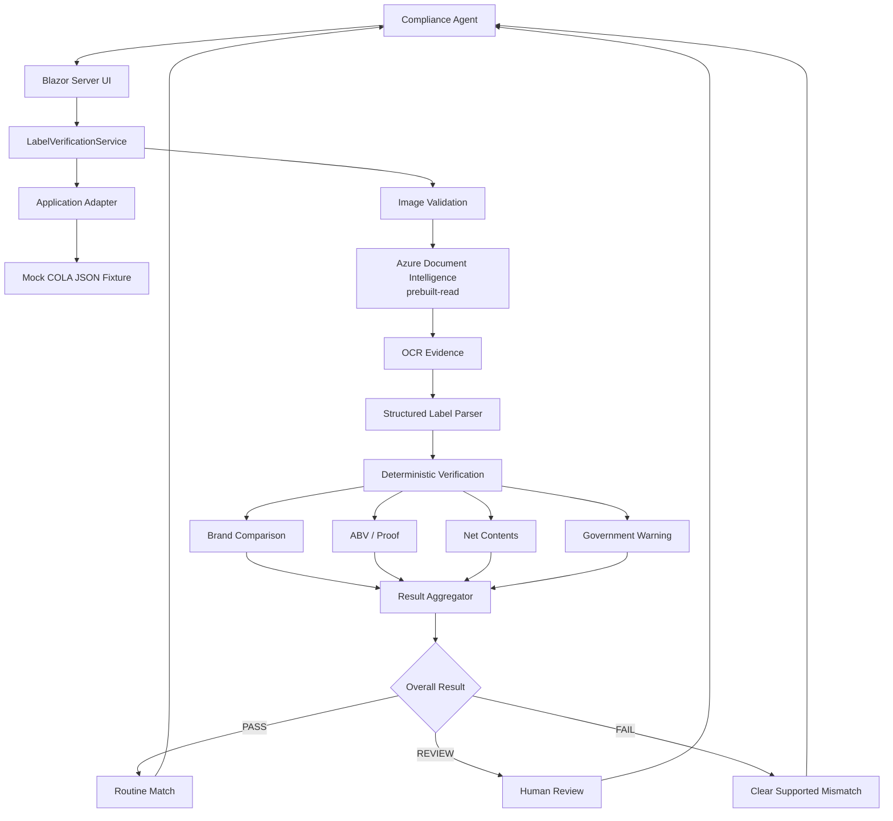
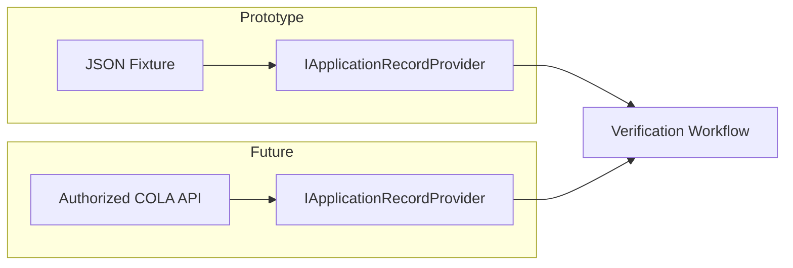
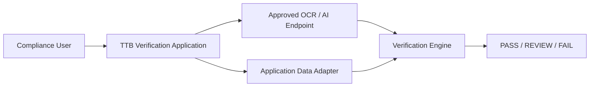
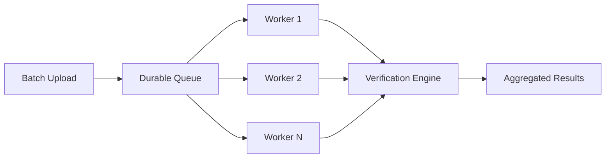
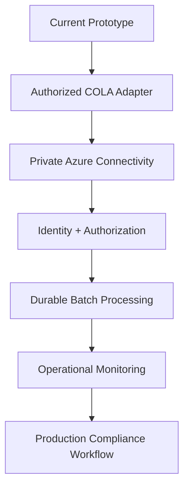

# AI-Powered Alcohol Label Verification

### Human-in-the-loop label verification for fast, explainable compliance review


> **Design principle:** Use AI for perception and ambiguity, deterministic rules for objective compliance checks, and human judgment for the final decision.

This prototype demonstrates how alcohol-label review work can be accelerated without turning an AI system into the regulatory decision-maker.

A submitted label image is validated, processed with Azure Document Intelligence, converted into structured evidence, compared with application-derived values, evaluated against supported regulatory rules, and presented to the compliance agent as an explainable:

**PASS · REVIEW · FAIL**

---

## Live Prototype

| Resource | Location |
|---|---|
| **Deployed application** | https://ttb-label-verification-iwluomsqzvz26.azurewebsites.net |
| **Source repository** | https://github.com/rawamba/ttb-ai-label-verification |
| **Application runtime** | .NET 8 / Blazor Server |
| **OCR provider** | Azure Document Intelligence `prebuilt-read` |
| **Hosting** | Azure App Service |
| **Infrastructure as Code** | Bicep |
| **Authentication to OCR** | Managed Identity in Azure / `DefaultAzureCredential` locally |

The prototype intentionally does **not** connect directly to the production COLA system.

---

# Evaluator Quick Walkthrough

The fastest way to evaluate the prototype is:

1. Open the deployed application.
2. Select the mock application record `COLA-84729`.
3. Upload a representative label image.
4. Select **Verify Label**.
5. Review the overall **PASS / REVIEW / FAIL** result.
6. Inspect the field-level evidence and explanations.
7. Review the OCR, verification, and total processing durations.
8. Use **Mark Reviewed** on REVIEW cases to exercise the human-review workflow.

Representative fixtures are available under:

```text
sample-data/labels/verification/
```

Useful demonstration scenarios include:

| Fixture | Scenario | Intended behavior |
|---|---|---|
| `compliant-label.png` | Baseline application match | PASS |
| `brand-variation-label.png` | Small brand-name variation | REVIEW |
| `incorrect-abv-label.png` | ABV mismatch | FAIL |
| `incorrect-proof-label.png` | Proof mismatch | FAIL |
| `incorrect-net-contents-label.png` | Net-contents mismatch | FAIL |
| `missing-warning-label.png` | Government Warning absent | REVIEW |
| `modified-warning-label.png` | Government Warning wording changed | FAIL |
| `rotated-label.png` | Rotated artwork | OCR robustness |
| `degraded-label.jpg` | Lower-quality image | OCR robustness |
| `compliant-with-glare.jpg` | Reflective glare | OCR robustness |
| `compliant-with-poor-light.jpg` | Poor lighting | OCR robustness |

All repository fixtures are synthetic and contain no production applicant data.

---

# Why This Approach

The stakeholder requirements create three competing goals:

- **Speed:** routine reviews should return in approximately five seconds.
- **Accuracy:** subtle label differences and regulatory wording matter.
- **Usability:** the tool should reduce agent workload rather than create another complicated system to operate.

The prototype therefore separates three responsibilities:

```text
AI / OCR
   |
   |  perceives what is visible on the label
   v
Structured Evidence
   |
   |  deterministic rules evaluate objective requirements
   v
PASS / REVIEW / FAIL
   |
   |  human expertise resolves ambiguity and makes final decisions
   v
Final Compliance Judgment
```

The system does **not** use a generative model as the final authority for deterministic compliance decisions.

---

# Architecture

The solution follows a layered architecture that isolates presentation, workflow orchestration, external services, and deterministic verification logic.



## Layer Responsibilities

| Layer | Responsibility |
|---|---|
| `LabelVerification.Web` | Blazor Server compliance-agent experience |
| `LabelVerification.Application` | Verification workflow orchestration and telemetry |
| `LabelVerification.Domain` | Deterministic comparison and supported compliance rules |
| `LabelVerification.Infrastructure` | Azure Document Intelligence and application-record adapters |

This separation allows the OCR provider, application-data source, and future COLA integration to evolve without coupling those implementation details to the verification rules.

---

# Verification Pipeline

```text
Label Image
    |
    v
File / Image Validation
    |
    v
Azure Document Intelligence
    |
    v
OCR Text + Confidence + Supported Style Evidence
    |
    v
Structured Parsing
    |
    +---------------------------+
    |                           |
    v                           v
Application-Derived Fields   Regulatory Evidence
    |                           |
    v                           v
Deterministic Comparisons    Government Warning Rules
    |                           |
    +-------------+-------------+
                  |
                  v
           Result Aggregation
                  |
          +-------+-------+
          |       |       |
          v       v       v
        PASS    REVIEW   FAIL
                  |
                  v
          Compliance Agent
```

The architecture deliberately separates:

1. **Perception** — OCR and extraction.
2. **Interpretation** — provider-neutral structured parsing.
3. **Compliance logic** — deterministic comparisons and supported rules.
4. **Decision support** — explainable PASS / REVIEW / FAIL.
5. **Final judgment** — human compliance agent.

---

# Verification Coverage

## Application-Derived Fields

| Field | Current strategy | Included in automated aggregate |
|---|---|---|
| **Brand name** | Normalization + fuzzy comparison | Yes |
| **Class / type** | Extracted and parsed | **Not yet included** |
| **Alcohol by volume** | Deterministic numeric comparison | Yes |
| **Proof** | Deterministic numeric comparison | Yes |
| **Net contents** | Value/unit normalization + deterministic comparison | Yes |

## Brand Name Example

```text
Application:
Stone's Throw

Detected:
STONE'S THROW

Normalized:
stones throw
stones throw

Result:
Equivalent after normalization
```

Minor punctuation or capitalization differences therefore do not automatically produce a false mismatch.

When similarity falls into an ambiguous band, the system surfaces **REVIEW** instead of manufacturing an unsupported PASS.

---

# Regulatory Rules

| Requirement | Current strategy |
|---|---|
| Government Warning presence | Deterministic |
| Government Warning wording | Strict rule-based validation |
| Required capitalization | Deterministic where OCR evidence supports evaluation |
| Bold warning heading | Evaluated when font-style evidence is available |
| Unsupported or uncertain evidence | REVIEW |

The Government Warning is intentionally modeled as a regulatory rule rather than application-specific expected data.

---

# Human-in-the-Loop Decision Model

The automated result is **decision-support evidence**, not autonomous regulatory adjudication.

## PASS

Used when supported required fields are detected with sufficient evidence and applicable deterministic comparisons pass.

## REVIEW

Used when automation should defer to human judgment, including situations such as:

- fuzzy brand similarity;
- incomplete OCR evidence;
- uncertain image quality;
- insufficient formatting evidence;
- missing or ambiguous fields;
- evidence that does not support a confident deterministic conclusion.

## FAIL

Used when the system has sufficient evidence of a clear supported mismatch or regulatory-rule failure.

## Final Authority

The compliance agent remains the final decision-maker.

A technical workflow completing successfully can therefore produce **PASS**, **REVIEW**, or **FAIL**.

---

# Application Data Boundary

The take-home assignment does not provide:

- a production COLA API contract;
- a production database schema;
- a sample production application payload;
- production authorization details for COLA.

The prototype therefore uses a deliberately small application contract behind an adapter abstraction.

```json
{
  "applicationId": "COLA-84729",
  "beverageType": "distilled_spirits",
  "expectedData": {
    "brandName": "Old Tom Distillery",
    "classType": "Kentucky Straight Bourbon Whiskey",
    "alcoholByVolume": 45.0,
    "proof": 90,
    "netContents": {
      "value": 750,
      "unit": "mL"
    }
  }
}
```

The architecture preserves a future COLA integration seam without pretending to know the internal structure of the production system.



The Government Warning is intentionally not stored in the mock application record because it represents a regulatory requirement rather than a value unique to a particular application.

---

# Measured Prototype Performance

A core stakeholder requirement is an approximately **five-second response target** for routine label checks.

The verification workflow records separate operational measurements for:

- `TotalDuration`
- `OcrDuration`
- `VerificationDuration`

This allows the prototype to identify performance bottlenecks empirically rather than infer them.

---

## Formal Warm-State Benchmark

The formal benchmark used five representative synthetic fixtures:

- baseline compliant label;
- brand-name variation;
- rotated label;
- degraded image;
- glare-affected image.

### Methodology

- One complete five-image warm-up pass
- Warm-up observations excluded from formal statistics
- Ten measured iterations per fixture
- **50 formal observations total**
- Fixture starting position rotated between iterations
- Azure Document Intelligence timeout fixed at five seconds
- Timeout and processing failures retained as target misses
- Nearest-rank percentile method used for p95

### Overall Results

| Metric | Result |
|---|---:|
| **Measured observations** | **50** |
| **Successful workflows** | **50 / 50** |
| **OCR timeouts during measured phase** | **0** |
| **Attempts meeting approximately five-second target** | **50 / 50 (100%)** |
| **Median observed latency** | **2.201 s** |
| **P95 observed latency** | **2.620 s** |
| **Worst observed latency** | **3.277 s** |
| Median OCR latency | 2.201 s |
| P95 OCR latency | 2.619 s |
| Worst OCR latency | 3.276 s |
| Median deterministic verification latency | < 1 ms |

> **Performance result:** The measured warm-state workflow met the approximately five-second stakeholder target on every formal benchmark attempt.

OCR accounted for nearly all observed processing latency.

Parsing, deterministic comparison, and result aggregation were sub-millisecond at the median in this benchmark.

A **successful workflow** means the technical verification pipeline completed. It does **not** mean the label received a regulatory PASS.

---

## Results by Fixture

| Fixture | N | Success | OCR Timeouts | ≤ 5 sec | Median | P95 | Worst |
|---|---:|---:|---:|---:|---:|---:|---:|
| `compliant-label.png` | 10 | 10 | 0 | 100% | 2.190 s | 2.195 s | 2.195 s |
| `brand-variation-label.png` | 10 | 10 | 0 | 100% | 2.182 s | 3.277 s | 3.277 s |
| `rotated-label.png` | 10 | 10 | 0 | 100% | 2.302 s | 2.620 s | 2.620 s |
| `degraded-label.jpg` | 10 | 10 | 0 | 100% | 2.206 s | 2.482 s | 2.482 s |
| `compliant-with-glare.jpg` | 10 | 10 | 0 | 100% | 2.203 s | 2.253 s | 2.253 s |

Detailed benchmark artifacts are available under:

```text
benchmark-results/
  warm-results.csv
  warm-summary.json
  warm-summary.md
```

The reusable benchmark harness is located at:

```text
tools/LabelVerification.Benchmarks/
```

---

# First-Use / Warm-Up Observation

Separate diagnostic runs identified a repeatable **first-use effect in the end-to-end OCR path**.

## Diagnostic A — Original Fixture Order

| Phase | Result |
|---|---|
| First pass | 3 / 5 completed; first 2 requests reached the five-second OCR timeout |
| Immediate second pass | 5 / 5 completed successfully |

## Diagnostic B — Reversed Fixture Order

| Phase | Result |
|---|---|
| First pass | 2 / 5 completed; first 3 requests reached the five-second OCR timeout |
| Immediate second pass | 5 / 5 completed successfully |

When fixture order was reversed, the failures moved with **request position** rather than remaining attached to particular images.

This is evidence of a first-use / warm-up effect rather than a consistent image-specific performance problem.

The prototype does **not** attribute this effect solely to Azure Document Intelligence.

First-use latency may include some combination of:

- credential discovery or token acquisition;
- .NET runtime or JIT initialization;
- Azure SDK initialization;
- connection establishment;
- TLS/network setup;
- provider-side processing variability.

The formal benchmark therefore reports steady-state measurements separately while documenting first-use behavior as a production-hardening consideration.

---

# Benchmark Timing Boundary

The primary benchmark metric is **observed verification-attempt latency**.

For completed workflows:

```text
ObservedAttempt = Application-layer TotalDuration
```

If an OCR exception occurs before normal workflow telemetry can be returned:

```text
ObservedAttempt = benchmark harness elapsed time
```

This prevents timeout attempts from being silently excluded and producing artificially favorable performance statistics.

The benchmark does **not** measure browser rendering time or Internet transport between the evaluator's browser and the deployed Blazor application.

---

# Benchmark Environment

| Property | Value |
|---|---|
| Benchmark location | Windows developer workstation → Azure Document Intelligence |
| Developer OS | Windows 11 Pro 64-bit |
| Runtime-reported OS version | Microsoft Windows 10.0.26200 |
| Runtime | .NET 8.0.30 |
| Development SDK | .NET SDK 10.0.300 |
| Process architecture | X64 |
| Logical processors visible to process | 16 |
| Azure region | East US 2 |
| Document Intelligence SKU | S0 |
| OCR model | `prebuilt-read` |
| OCR timeout | 5 seconds |
| Font-style extraction | Enabled |
| Authentication | `DefaultAzureCredential` |
| Formal sample size | 50 |
| Excluded warm-up observations | 5 |
| Source commit | `96cdd6ca966a82f63ca72bc6c9b287ba2a574e6b` |

---

# Observability

The verification workflow emits non-sensitive operational telemetry.

Supported telemetry includes:

- workflow correlation ID;
- OCR duration;
- deterministic verification duration;
- total Application-layer duration;
- result category;
- processing error category.

Sensitive document data is intentionally excluded.

The application does **not** write the following as verification telemetry:

- uploaded image contents;
- OCR document text;
- extracted label values;
- Government Warning text;
- uploaded filename.

The Web layer also provides HTTP request correlation separately from the workflow-level verification correlation ID.

---

# Technology Stack

| Area | Technology |
|---|---|
| Application platform | .NET 8 |
| UI | Blazor Server |
| Language | C# |
| OCR / AI perception | Azure Document Intelligence |
| OCR model | `prebuilt-read` |
| Verification | Deterministic and fuzzy field-specific rules |
| Application data | JSON fixture through adapter abstraction |
| Hosting | Azure App Service for Linux |
| Azure authentication | System-assigned Managed Identity |
| Local Azure authentication | `DefaultAzureCredential` |
| Infrastructure as Code | Bicep |
| CI/CD | Azure Pipelines |
| Testing | xUnit |
| Benchmarking | Dedicated .NET benchmark harness |

---

# Azure Deployment

The prototype is deployed to Azure App Service.

```text
Compliance Agent
      |
      | HTTPS
      v
Azure App Service
Blazor Server / .NET 8
      |
      | Managed Identity
      v
Azure Document Intelligence
prebuilt-read
      |
      v
Verification Workflow
```

Current prototype characteristics include:

- Linux Azure App Service;
- .NET 8 runtime;
- HTTPS-only access;
- Always On enabled;
- one application worker;
- Azure Document Intelligence in East US 2;
- S0 Document Intelligence SKU;
- system-assigned Managed Identity;
- scoped `Cognitive Services User` RBAC;
- no Cognitive Services API key stored in application configuration.

The public Azure Document Intelligence endpoint is retained for the evaluator-accessible prototype.

A production environment would evaluate additional network isolation and private connectivity requirements.

---

# Security and Privacy

Security decisions in the prototype are intentionally visible rather than implied.

## Implemented Prototype Controls

- HTTPS-only application access
- system-assigned Managed Identity
- Azure RBAC for Document Intelligence
- no OCR API keys stored in application configuration
- upload type validation
- upload size validation
- bounded in-memory processing
- no requirement for persistent label-image storage
- structured error handling
- non-sensitive operational telemetry
- deterministic compliance logic separated from AI extraction
- human review for ambiguous evidence

## Production Evolution

A production Treasury environment would additionally require consideration of:

- Microsoft Entra ID / federal SSO;
- role-based application authorization;
- private endpoints;
- private DNS;
- VNet integration;
- firewall and NSG controls;
- encryption and key-management requirements;
- centralized audit logging;
- records-management requirements;
- document-retention policies;
- PII handling;
- security assessment and authorization;
- applicable NIST controls;
- applicable Treasury security controls.

The prototype does not claim to represent a completed production ATO or FedRAMP deployment.

---

# Network-Constrained Architecture

Stakeholder discovery identified restricted outbound connectivity as an important operational constraint.

The browser does not connect directly to the OCR service. OCR calls are initiated server-side by the application.



For the evaluator-accessible prototype, Azure Document Intelligence uses its public service endpoint.

For production, the architecture supports evolving toward:

```text
Application
    |
    v
VNet Integration
    |
    v
Private Endpoint
    |
    v
Azure Document Intelligence
```

without changing the deterministic verification rules.

---

# Batch Processing

Stakeholders identified submissions containing approximately 200–300 labels.

The current prototype intentionally implements a focused **single-label workflow**.

Batch upload is **not currently implemented**.

The architecture supports a future batch-processing model such as:



A production-scale implementation could add:

- bounded concurrency;
- durable queues;
- temporary secure object storage;
- retry handling;
- horizontal worker scaling;
- per-label correlation IDs;
- batch-level reporting.

---

# Error Handling

The application distinguishes technical processing failures from compliance outcomes.

Examples include:

- unsupported upload format;
- empty image;
- invalid image signature;
- application record not found;
- OCR timeout;
- OCR service failure;
- unreadable or incomplete evidence.

Technical failures do not manufacture a compliance PASS or FAIL.

Where the evidence itself is ambiguous, the preferred outcome is **REVIEW**.

---

# Testing Strategy

The repository uses deterministic automated tests for the core application and an opt-in live Azure OCR test for external-service validation.

## Unit Tests

Coverage includes areas such as:

- textual normalization;
- fuzzy brand comparison;
- ABV comparison;
- proof comparison;
- net-content normalization;
- Government Warning validation;
- missing-field behavior;
- result aggregation;
- structured parsing.

## Integration Tests

Integration coverage includes:

- application composition;
- JSON application-adapter loading;
- structured parser integration;
- complete verification workflow;
- application-not-found behavior;
- invalid-image behavior;
- OCR failure behavior;
- workflow telemetry;
- sensitive-log protections.

Normal CI replaces the external OCR dependency with controlled OCR evidence so deterministic tests do not depend on live Azure availability.

## Live OCR Test

Azure Document Intelligence integration testing is explicitly opt-in.

```powershell
$env:RUN_LIVE_OCR_TESTS = "true"

dotnet test `
    ".\tests\LabelVerification.IntegrationTests\LabelVerification.IntegrationTests.csproj" `
    --configuration Release
```

Normal CI intentionally leaves:

```text
RUN_LIVE_OCR_TESTS=false
```

External-service latency and transient availability therefore do not determine whether deterministic application logic passes CI.

---

# Representative Test Dataset

Synthetic verification fixtures are located under:

```text
sample-data/labels/verification/
```

The dataset covers:

- fully compliant labels;
- brand-name variations;
- incorrect ABV;
- incorrect proof;
- incorrect net contents;
- missing Government Warning;
- modified Government Warning;
- rotation;
- image degradation;
- glare;
- poor lighting;
- alternate layouts.

The dataset manifest is:

```text
sample-data/labels/verification/manifest.json
```

The manifest documents intended behavior, fixture purpose, and known verification boundaries.

---

# Local Development

## Prerequisites

- Git
- .NET 8 SDK or later
- Azure CLI
- an Azure identity authorized to invoke the prototype Document Intelligence resource

The projects target .NET 8.

Development and benchmark validation were performed using .NET SDK 10.0.300.

---

## Clone the Repository

```powershell
git clone https://github.com/rawamba/ttb-ai-label-verification.git

cd ttb-ai-label-verification
```

---

## Authenticate to Azure

```powershell
az login
```

The local identity must have permission to invoke Azure Document Intelligence.

The application uses `DefaultAzureCredential`, allowing local development to use supported developer credentials while Azure App Service uses Managed Identity.

---

## Configure OCR

```powershell
$env:DocumentIntelligence__Endpoint =
    "https://docintel-ttb-label-verification-iwluomsqzvz26.cognitiveservices.azure.com/"

$env:DocumentIntelligence__ModelId =
    "prebuilt-read"

$env:DocumentIntelligence__TimeoutSeconds =
    "5"

$env:DocumentIntelligence__EnableFontStyling =
    "true"
```

---

## Restore and Build

```powershell
dotnet restore LabelVerification.slnx

dotnet build LabelVerification.slnx `
    --configuration Release
```

---

## Run Deterministic Tests

```powershell
Remove-Item Env:RUN_LIVE_OCR_TESTS `
    -ErrorAction SilentlyContinue

dotnet test LabelVerification.slnx `
    --configuration Release
```

---

## Run the Application

```powershell
dotnet run `
    --project ".\src\LabelVerification.Web\LabelVerification.Web.csproj"
```

Use the local URL emitted by ASP.NET Core.

---

# Reproducing the Performance Benchmark

Configure the OCR environment as described above.

Then configure benchmark metadata:

```powershell
$env:BENCHMARK_AZURE_REGION =
    "East US 2"

$env:BENCHMARK_DOCINTEL_SKU =
    "S0"

$env:BENCHMARK_LOCATION =
    "Windows 11 developer workstation to Azure Document Intelligence"
```

Run:

```powershell
dotnet run `
    --project ".\tools\LabelVerification.Benchmarks\LabelVerification.Benchmarks.csproj" `
    --configuration Release
```

The benchmark performs:

```text
5 excluded warm-up observations
+
50 measured observations
=
55 total OCR attempts
```

Results are written to:

```text
benchmark-results/
```

The benchmark does not persist:

- OCR text;
- image bytes;
- extracted label values.

---

# CI/CD

Azure Pipelines provides continuous integration and deployment.

## Pull Requests

PR validation performs:

```text
Restore
   |
   v
Build
   |
   v
Deterministic Tests
   |
   v
Package Validation
```

Live OCR is not required for PR success.

## Main Branch

The main-branch workflow validates the codebase, packages the application, deploys the approved artifact, and performs a health check.

The deployed application exposes:

```text
/health
```

The repository uses protected-main development with feature branches and pull requests.

---

# Infrastructure as Code

Azure resources are represented through Bicep.

Relevant modules include:

```text
infra/
  modules/
    app-service.bicep
    document-intelligence.bicep
    cognitive-services-rbac.bicep
```

Infrastructure responsibilities include:

- App Service configuration;
- Azure Document Intelligence provisioning;
- Managed Identity;
- scoped Cognitive Services RBAC;
- application settings.

This keeps the prototype infrastructure repeatable and reviewable.

---

# Repository Structure

```text
ttb-ai-label-verification/
|
+-- src/
|   +-- LabelVerification.Web/
|   +-- LabelVerification.Application/
|   +-- LabelVerification.Domain/
|   +-- LabelVerification.Infrastructure/
|
+-- tests/
|   +-- LabelVerification.UnitTests/
|   +-- LabelVerification.IntegrationTests/
|
+-- sample-data/
|   +-- applications/
|   +-- labels/
|       +-- verification/
|
+-- tools/
|   +-- LabelVerification.Benchmarks/
|
+-- benchmark-results/
|
+-- infra/
|
+-- azure-pipelines.yml
+-- LabelVerification.slnx
+-- README.md
```

---

# Key Engineering Trade-offs

## Deterministic Rules Over Unrestricted AI Reasoning

Objective compliance comparisons are implemented with explicit rules.

Benefits include:

- reproducibility;
- traceability;
- testability;
- performance;
- explainability.

---

## Human Review Over Forced Automation

Ambiguous evidence is routed to **REVIEW** rather than forcing an unsupported binary decision.

---

## Adapter Boundary Over Simulated COLA Integration

The prototype models only the application data required for verification rather than inventing a production COLA API.

---

## Managed Identity Over API Keys

Azure-hosted OCR access uses Managed Identity and scoped RBAC rather than embedded Cognitive Services credentials.

---

## Measured Performance Over Assumed Performance

Pipeline instrumentation and a repeatable benchmark harness measure latency empirically.

---

## Controlled Azure Dependency Over Unrestricted Network Dependencies

The application uses a defined server-side Azure OCR boundary rather than requiring browser clients to access arbitrary external services.

The architecture supports tighter production network controls without changing the verification engine.

---

## Working Core Over Broad Regulatory Coverage

The prototype prioritizes a coherent, tested end-to-end workflow over incomplete implementation of every possible beverage-specific labeling requirement.

---

# Known Limitations

The prototype intentionally documents its boundaries.

Current limitations include:

- class/type is extracted and parsed but is **not yet included in the automated result aggregate**;
- no direct production COLA integration;
- no production federal identity / SSO integration;
- no batch-upload UI;
- no long-term document persistence;
- no complete beverage-specific regulatory coverage;
- typography validation is limited to evidence exposed by the OCR provider;
- browser-to-server latency is not represented in Application-layer benchmark measurements;
- first-use OCR-path latency can exceed the five-second timeout;
- no autonomous final regulatory adjudication.

These are explicit engineering boundaries rather than hidden assumptions.

---

# Production Evolution

A production implementation could evolve incrementally without replacing the core deterministic verification engine.

Potential next capabilities include:

- authorized COLA adapter;
- federal authentication and authorization;
- private Azure AI endpoints;
- private DNS and VNet integration;
- durable batch queues;
- secure temporary object storage;
- horizontal scaling;
- richer image preprocessing;
- versioned regulatory rules;
- audit history;
- operational dashboards;
- performance monitoring;
- OCR/model quality monitoring;
- automated rule-regression suites;
- records-management controls.



---

# Assumptions

The prototype assumes:

1. Application-derived expected values are available through an upstream authorized system.
2. The upstream application record is authoritative for those values.
3. Government Warning requirements come from the regulatory rule set rather than the individual application record.
4. OCR is evidence extraction, not final compliance authority.
5. Ambiguous automation outcomes should be reviewed by a human.
6. Production security, retention, network, identity, and authorization requirements would be implemented before operational use.

---

# Regulatory Scope

The prototype implements a bounded subset of alcohol-label verification behavior informed by TTB labeling requirements.

It is not intended to encode every beverage-specific rule or replace official regulatory guidance.

For production use, regulatory rules should be:

- reviewed by subject-matter experts;
- traceable to authoritative requirements;
- version-controlled;
- regression-tested;
- updated when governing requirements change.

---

# Final Design Principle

```text
AI for perception.

Deterministic rules for objective compliance.

Human judgment for the final decision.
```

That separation is the central architectural choice in this prototype.

---

## License

MIT License

Copyright © 2026 Roger Wamba