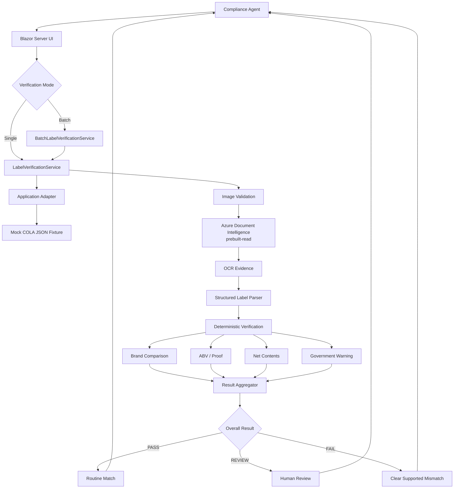
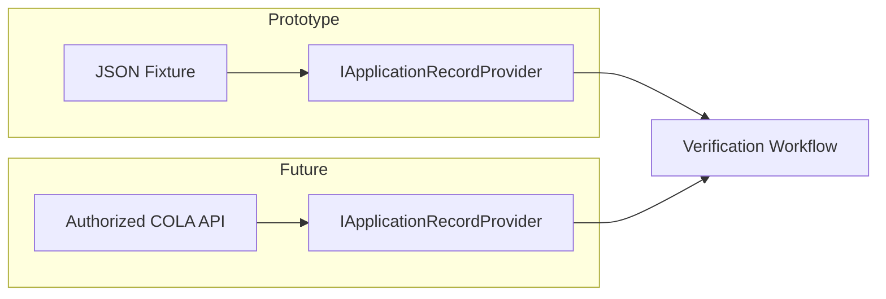
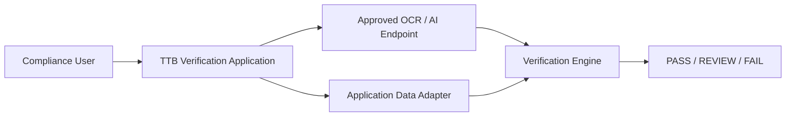
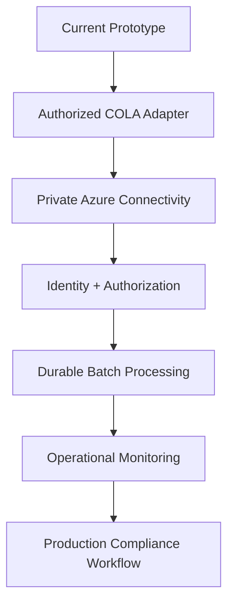

<!--
TTB AI-Powered Alcohol Label Verification
Evaluator-facing repository README.

Maintenance guidance:
- Describe implemented prototype behavior accurately.
- Keep regulatory automation explicitly bounded.
- Separate technical processing failures from regulatory outcomes.
- Distinguish per-label latency from batch throughput.
- Distinguish authentication/startup readiness from the five-second OCR
  provider-operation timeout.
- Do not describe future COLA, durable queueing, or private networking as
  implemented.
-->

# AI-Powered Alcohol Label Verification

### Human-in-the-loop label verification for fast, explainable compliance review


> **Design principle:** Use AI for perception and ambiguity, deterministic rules for objective compliance checks, and human judgment for the final decision.

This prototype demonstrates how alcohol-label review work can be accelerated without turning an AI system into the regulatory decision-maker.

A submitted label image is validated, processed with Azure Document Intelligence, converted into structured evidence, compared with application-derived values, evaluated against supported regulatory rules, and presented to the compliance agent as an explainable:

**PASS · REVIEW · FAIL**

Technical processing problems are reported separately as:

**ERROR**

The application supports both:

- **Single-label verification** for one image at a time.
- **Batch verification** for multiple label images associated with the same application record.

---

## Live Prototype

| Resource | Location |
|---|---|
| **Deployed application** | https://ttb-label-verification-iwluomsqzvz26.azurewebsites.net |
| **Source repository** | https://github.com/rawamba/ttb-ai-label-verification |
| **Application runtime** | .NET 8 / Blazor Server |
| **OCR provider** | Azure Document Intelligence `prebuilt-read` |
| **Hosting** | Azure App Service |
| **Infrastructure as Code** | Bicep |
| **Authentication to OCR** | Managed Identity in Azure / `DefaultAzureCredential` locally |

The prototype intentionally does **not** connect directly to the production COLA system.

---

## Engineering Documentation

Additional engineering documentation is available under [`docs/`](docs/):

| Document | Purpose |
|---|---|
| [Application Architecture](docs/architecture.md) | Implemented architecture, single-label and batch workflows, Azure deployment, security boundaries, telemetry, performance, and known limitations |
| [Regulatory References](docs/regulatory-references.md) | Regulatory traceability for the bounded distilled-spirits verification rules implemented by the prototype |
| [Architecture Decision Records](docs/decisions/) | Context, decisions, alternatives, and consequences behind significant engineering choices |

### Architecture Decision Records

| ADR | Decision |
|---|---|
| [ADR 0001](docs/decisions/0001-layered-architecture.md) | Use a layered application architecture |
| [ADR 0002](docs/decisions/0002-hybrid-verification-strategy.md) | Use AI-assisted perception, deterministic verification, and human review |
| [ADR 0003](docs/decisions/0003-cola-adapter-boundary.md) | Treat COLA as an upstream system behind an adapter boundary |
| [ADR 0004](docs/decisions/0004-azure-document-intelligence.md) | Use Azure Document Intelligence behind the OCR abstraction |
| [ADR 0005](docs/decisions/0005-managed-identity-and-rbac.md) | Use Managed Identity and scoped Azure RBAC for OCR access |
| [ADR 0006](docs/decisions/0006-verification-telemetry.md) | Instrument the verification workflow with non-sensitive stage telemetry |

---

## Evaluator Quick Walkthrough

<!--
The evaluator walkthrough demonstrates both modes while keeping the same
underlying verification engine and human-review model.
-->

The fastest way to evaluate the prototype is:

1. Open the deployed application.
2. Select the mock application record `COLA-84729`.
3. Choose **Single label** or **Batch upload**.
4. Upload one or more representative label images.
5. Start verification.
6. Review the overall **PASS / REVIEW / FAIL** result for each label.
7. Inspect field-level evidence and explanations.
8. In batch mode, filter results by **PASS**, **REVIEW**, **FAIL**, or **ERROR**.
9. Open individual batch results to inspect the same evidence used by single-label verification.
10. Treat **REVIEW** as a human decision point rather than an automated failure.

Representative fixtures are available under:

```text
sample-data/labels/verification/
```

Useful demonstration scenarios include:

| Fixture | Scenario | Intended behavior |
|---|---|---|
| `compliant-label.png` | Baseline application match | PASS |
| `brand-variation-label.png` | Small brand-name variation | REVIEW |
| `incorrect-abv-label.png` | ABV mismatch | FAIL |
| `incorrect-proof-label.png` | Proof mismatch | FAIL |
| `incorrect-net-contents-label.png` | Net-contents mismatch | FAIL |
| `missing-warning-label.png` | Government Warning absent | REVIEW |
| `modified-warning-label.png` | Government Warning wording changed | FAIL |
| `rotated-label.png` | Rotated artwork | OCR robustness |
| `degraded-label.jpg` | Lower-quality image | OCR robustness |
| `compliant-with-glare.jpg` | Reflective glare | OCR robustness |
| `compliant-with-poor-light.jpg` | Poor lighting | OCR robustness |

All repository fixtures are synthetic and contain no production applicant data.

---

## Why This Approach

The stakeholder requirements create three competing goals:

- **Speed:** routine label checks should return in approximately five seconds per label.
- **Accuracy:** subtle label differences and regulatory wording matter.
- **Usability:** the tool should reduce agent workload rather than create another complicated system to operate.

The prototype therefore separates three responsibilities:

```text
AI / OCR
   |
   |  perceives what is visible on the label
   v
Structured Evidence
   |
   |  deterministic rules evaluate objective requirements
   v
PASS / REVIEW / FAIL
   |
   |  human expertise resolves ambiguity and makes final decisions
   v
Final Compliance Judgment
```

The system does **not** use a generative model as the final authority for deterministic compliance decisions.

---

## Architecture

The solution follows a layered architecture that isolates presentation, workflow orchestration, external services, and deterministic verification logic.



### Layer Responsibilities

| Layer | Responsibility |
|---|---|
| `LabelVerification.Web` | Blazor Server compliance-agent experience, upload handling, batch staging, results, and human-review UX |
| `LabelVerification.Application` | Single-label and batch workflow orchestration, verification services, progress, and telemetry |
| `LabelVerification.Domain` | Business concepts and deterministic verification models |
| `LabelVerification.Infrastructure` | Azure Document Intelligence and application-record adapters |

This separation allows the OCR provider, application-data source, and future COLA integration to evolve without coupling those implementation details to the verification rules.

---

## Verification Pipeline

```text
Label Image
    |
    v
File / Image Validation
    |
    v
Azure Authentication Readiness
    |
    v
Azure Document Intelligence
    |
    v
OCR Text + Confidence + Supported Style Evidence
    |
    v
Structured Parsing
    |
    +---------------------------+
    |                           |
    v                           v
Application-Derived Fields   Regulatory Evidence
    |                           |
    v                           v
Deterministic Comparisons    Government Warning Rules
    |                           |
    +-------------+-------------+
                  |
                  v
           Result Aggregation
                  |
          +-------+-------+
          |       |       |
          v       v       v
        PASS    REVIEW   FAIL
                  |
                  v
          Compliance Agent
```

The architecture deliberately separates:

1. **Authentication readiness** — establish Azure identity/token readiness before the latency-sensitive OCR operation begins.
2. **Perception** — OCR and extraction.
3. **Interpretation** — provider-neutral structured parsing.
4. **Compliance logic** — deterministic comparisons and supported rules.
5. **Decision support** — explainable PASS / REVIEW / FAIL.
6. **Final judgment** — human compliance agent.

---

## Batch Verification Workflow

<!--
The batch coordinator reuses the existing single-label verification service.
It coordinates work but does not duplicate regulatory logic.
-->

Stakeholders identified submissions containing approximately 200–300 labels.

The prototype implements a batch workflow designed for that use case.

### Current Batch Behavior

The batch workflow supports:

- multiple-label selection;
- configurable maximum batch size;
- default maximum batch size of **300 labels**;
- bounded concurrency;
- default maximum concurrency of **3 labels**;
- per-label processing state;
- per-label regulatory result;
- per-label fault isolation;
- live progress;
- PASS / REVIEW / FAIL / ERROR filtering;
- result search;
- per-label drill-down;
- preservation of human review for REVIEW outcomes;
- batch-level correlation;
- retention of the existing per-label workflow correlation identifier.

The batch coordinator does **not** implement regulatory rules itself.

Instead:

```text
BatchLabelVerificationService
        |
        +--> LabelVerificationService
        |
        +--> LabelVerificationService
        |
        +--> LabelVerificationService
        |
        ...
```

Every item reuses the same existing single-label verification workflow.

### Processing State vs Regulatory Status

The batch workflow intentionally separates technical processing state from regulatory outcome.

Technical processing states include:

```text
Pending
Processing
Completed
Error
```

Regulatory results include:

```text
PASS
REVIEW
FAIL
```

A technical `ERROR` is **not** a regulatory `FAIL`.

This prevents infrastructure or OCR failures from being misrepresented as compliance determinations.

### Fault Isolation

Each label is processed independently.

A technical problem affecting one image does not terminate the remaining batch where independent processing can continue.

For example:

```text
Label 1 -> PASS
Label 2 -> ERROR
Label 3 -> REVIEW
Label 4 -> FAIL
Label 5 -> PASS
```

The batch still returns the independently completed results.

### Bounded Concurrency

The prototype does not launch hundreds of OCR requests simultaneously.

The default configuration is:

```text
MaxBatchSize = 300
MaxConcurrency = 3
```

These values are configurable.

Bounded concurrency protects:

- Azure OCR capacity;
- application resources;
- latency stability;
- predictable fault behavior.

### Temporary Upload Staging

Blazor Server browser-file streams are not used concurrently by OCR workers.

Selected batch images are first copied sequentially to randomly named temporary server files.

```text
Browser
   |
   | sequential upload
   v
Temporary server staging
   |
   +--> Worker 1
   +--> Worker 2
   +--> Worker 3
           |
           v
Existing verification workflow
```

Temporary files are deleted when batch processing completes or terminates.

The prototype does **not** implement long-term document persistence.

---

## Verification Coverage

### Application-Derived Fields

| Field | Current strategy | Included in automated aggregate |
|---|---|---|
| **Brand name** | Normalization + fuzzy comparison | Yes |
| **Class / type** | Extracted and parsed | **Not yet included** |
| **Alcohol by volume** | Deterministic numeric comparison | Yes |
| **Proof** | Deterministic numeric comparison | Yes |
| **Net contents** | Value/unit normalization + deterministic comparison | Yes |

### Brand Name Example

```text
Application:
Stone's Throw

Detected:
STONE'S THROW

Normalized:
stones throw
stones throw

Result:
Equivalent after normalization
```

Minor punctuation or capitalization differences therefore do not automatically produce a false mismatch.

When similarity falls into an ambiguous band, the system surfaces **REVIEW** instead of manufacturing an unsupported PASS.

---

## Regulatory Rules

| Requirement | Current strategy |
|---|---|
| Government Warning presence | Deterministic |
| Government Warning wording | Strict rule-based validation |
| Required capitalization | Deterministic where OCR evidence supports evaluation |
| Bold warning heading | Evaluated when font-style evidence is available |
| Unsupported or uncertain evidence | REVIEW |

The Government Warning is intentionally modeled as a regulatory rule rather than application-specific expected data.

---

## Human-in-the-Loop Decision Model

The automated result is **decision-support evidence**, not autonomous regulatory adjudication.

### PASS

Used when supported required fields are detected with sufficient evidence and applicable deterministic comparisons pass.

### REVIEW

Used when automation should defer to human judgment, including situations such as:

- fuzzy brand similarity;
- incomplete OCR evidence;
- uncertain image quality;
- insufficient formatting evidence;
- missing or ambiguous fields;
- evidence that does not support a confident deterministic conclusion.

### FAIL

Used when the system has sufficient evidence of a clear supported mismatch or regulatory-rule failure.

### ERROR

Used when the technical processing workflow could not complete.

Examples include:

- unreadable image stream;
- authentication-readiness failure;
- OCR provider failure;
- invalid application data;
- unexpected technical exception.

`ERROR` is deliberately separate from PASS / REVIEW / FAIL.

### Final Authority

The compliance agent remains the final decision-maker.

A technical workflow completing successfully can therefore produce **PASS**, **REVIEW**, or **FAIL**.

---

## Application Data Boundary

The take-home assignment does not provide:

- a production COLA API contract;
- a production database schema;
- a sample production application payload;
- production authorization details for COLA.

The prototype therefore uses a deliberately small application contract behind an adapter abstraction.

```json
{
  "applicationId": "COLA-84729",
  "beverageType": "distilled_spirits",
  "expectedData": {
    "brandName": "Old Tom Distillery",
    "classType": "Kentucky Straight Bourbon Whiskey",
    "alcoholByVolume": 45.0,
    "proof": 90,
    "netContents": {
      "value": 750,
      "unit": "mL"
    }
  }
}
```

The architecture preserves a future COLA integration seam without pretending to know the internal structure of the production system.



The Government Warning is intentionally not stored in the mock application record because it represents a regulatory requirement rather than a value unique to a particular application.

---

## Azure Authentication Readiness

<!--
Authentication readiness is intentionally separate from the normal
five-second OCR provider-operation timeout.
-->

The OCR client and extractor share a single Azure `TokenCredential`.

The shared credential uses an in-process token cache so concurrent first-use requests can reuse the same valid Cognitive Services access token.

The workflow establishes authentication readiness before starting the latency-sensitive Azure Document Intelligence operation.

Default timing boundaries are:

```text
Authentication readiness timeout: 15 seconds
OCR provider-operation timeout:     5 seconds
```

This separation does **not** hide startup latency.

The Application-layer workflow still measures the complete extractor invocation, and batch wall-clock measurements still include first-use startup cost.

The design prevents credential discovery or token acquisition from consuming the entire five-second OCR provider-operation budget.

---

## Measured Prototype Performance

A core stakeholder requirement is an approximately **five-second response target per routine label verification**.

The prototype measures single-label latency and batch throughput separately.

> **The approximately five-second target applies to an individual label-processing operation after required startup readiness is established. It is not a claim that a 30-, 200-, or 300-label batch completes in five seconds.**

---

### Formal Single-Label Warm-State Benchmark

The formal single-label benchmark used five representative synthetic fixtures.

#### Methodology

- One complete five-image warm-up pass.
- Warm-up observations excluded from formal statistics.
- Ten measured iterations per fixture.
- **50 formal observations total.**
- Fixture starting position rotated between iterations.
- Azure Document Intelligence provider-operation timeout fixed at five seconds.
- Timeout and processing failures retained as target misses.
- Nearest-rank percentile method used for p95.

#### Overall Results

| Metric | Result |
|---|---:|
| **Measured observations** | **50** |
| **Successful workflows** | **50 / 50** |
| **OCR timeouts during measured phase** | **0** |
| **Attempts meeting approximately five-second target** | **50 / 50 (100%)** |
| **Median observed latency** | **2.201 s** |
| **P95 observed latency** | **2.620 s** |
| **Worst observed latency** | **3.277 s** |
| Median OCR latency | 2.201 s |
| P95 OCR latency | 2.619 s |
| Worst OCR latency | 3.276 s |
| Median deterministic verification latency | < 1 ms |

> **Performance result:** The measured warm-state single-label workflow met the approximately five-second stakeholder target on every formal benchmark attempt.

OCR accounted for nearly all observed processing latency.

Parsing, deterministic comparison, and result aggregation were sub-millisecond at the median in this benchmark.

A **successful workflow** means the technical verification pipeline completed. It does **not** mean the label received a regulatory PASS.

---

### Formal Batch Throughput Benchmark

<!--
Batch wall-clock duration and per-item latency are intentionally reported
separately. This prevents the five-second per-label target from being
misinterpreted as a whole-batch SLA.
-->

The implemented batch coordinator was measured using:

```text
30 labels per batch
3 measured batches
3 maximum concurrent labels
90 formal label attempts
```

An additional six-label concurrent warm-up batch was executed and excluded from formal statistics.

#### Final Batch Results

| Metric | Result |
|---|---:|
| **Measured batches** | **3** |
| **Labels per measured batch** | **30** |
| **Formal label attempts** | **90** |
| **Returned item results** | **90 / 90** |
| **Technical errors** | **0** |
| **Per-label attempts within five seconds** | **90 / 90 (100%)** |
| **Median per-label duration** | **2.213 s** |
| **P95 per-label duration** | **2.396 s** |
| **Worst per-label duration** | **3.239 s** |
| **Median 30-label batch wall time** | **23.038 s** |
| **P95 30-label batch wall time** | **23.747 s** |
| **Median throughput** | **78.1 labels/min** |
| **P95 measured throughput** | **79.8 labels/min** |
| Maximum concurrency | 3 |

Regulatory outcomes across the 90 measured labels were:

| Result | Count |
|---|---:|
| PASS | 36 |
| REVIEW | 18 |
| FAIL | 36 |
| Technical ERROR | 0 |

These outcome counts reflect the deliberately mixed synthetic benchmark fixture pool.

They are **not** a quality score or pass-rate claim.

#### Excluded Warm-Up Batch

The final benchmark used a six-label concurrent warm-up batch.

Observed warm-up behavior:

```text
6 requested
6 returned
0 technical errors
10.739 s batch wall time
33.5 labels/min
```

The warm-up demonstrates that first-use startup remains materially slower than steady-state processing even though it no longer produces OCR timeout failures in the measured implementation.

The warm-up is therefore retained as diagnostic evidence and excluded from formal steady-state statistics.

#### Benchmark Evidence

Single-label benchmark artifacts:

```text
benchmark-results/
  warm-results.csv
  warm-summary.json
  warm-summary.md
```

Batch benchmark artifacts:

```text
benchmark-results/
  batch-results.csv
  batch-item-results.csv
  batch-summary.json
  batch-summary.md
```

The reusable benchmark harness is located under:

```text
tools/LabelVerification.Benchmarks/
```

---

## First-Use / Warm-Up Observation

Earlier diagnostics identified a repeatable **first-use effect in the end-to-end OCR path**.

Before authentication readiness was separated from the five-second OCR provider-operation budget, early concurrent requests could consume that budget during startup and reach the timeout boundary.

The failure pattern moved with **request position** rather than remaining associated with particular label fixtures.

That evidence supported a startup/readiness problem rather than an image-specific OCR defect.

The prototype does **not** claim that authentication was proven to be the sole contributor to all startup latency.

Potential first-use contributors still include:

- credential discovery;
- token acquisition;
- .NET runtime or JIT initialization;
- Azure SDK initialization;
- connection establishment;
- TLS/network setup;
- provider-side processing variability.

### Implemented Mitigation

The final implementation:

1. shares one Azure credential between authentication readiness and the Document Intelligence client;
2. caches a valid token in process;
3. bounds authentication readiness separately at **15 seconds**;
4. starts the normal **five-second OCR provider-operation timeout only after authentication readiness succeeds**; and
5. continues measuring startup cost in Application telemetry and batch wall-clock timing.

The mitigation is supported by the final live batch evidence:

```text
Excluded warm-up:
6 / 6 returned
0 errors

Formal measured phase:
90 / 90 returned
0 technical errors
90 / 90 within the five-second per-item provider-operation target
```

This evidence supports the mitigation while avoiding the stronger claim that authentication was conclusively the only source of first-use latency.

---

## Benchmark Timing Boundaries

### Authentication Readiness

The extractor first ensures a valid Azure Cognitive Services token is available.

```text
AuthenticationReadinessTimeout = 15 seconds
```

This is a startup/reuse boundary rather than the normal OCR provider-operation target.

### Single-Label OCR Operation

After authentication readiness succeeds:

```text
OcrProviderOperationTimeout = 5 seconds
```

For completed workflows:

```text
Application OcrDuration = complete extractor invocation
Application TotalDuration = complete verification workflow
```

Application telemetry therefore continues to expose authentication/startup cost.

### Batch Benchmark

For each label:

```text
ItemDuration = independent batch-item verification duration
```

For the whole batch:

```text
BatchWallTime = benchmark-observed elapsed time
```

Throughput is calculated separately:

```text
LabelsPerMinute = returned item count / batch wall time
```

Browser rendering, browser upload time, temporary browser-to-server staging, and human-review time are not included in the service-throughput benchmark.

---

## Benchmark Environment

| Property | Value |
|---|---|
| Benchmark location | Windows developer workstation → Azure Document Intelligence |
| Developer OS | Windows 11 Pro 64-bit |
| Runtime-reported OS version | Microsoft Windows 10.0.26200 |
| Runtime | .NET 8.0.30 |
| Development SDK | .NET SDK 10.0.300 |
| Process architecture | X64 |
| Logical processors visible to process | 16 |
| Azure region | East US 2 |
| Document Intelligence SKU | S0 |
| OCR model | `prebuilt-read` |
| Authentication-readiness timeout | 15 seconds |
| OCR provider-operation timeout | 5 seconds |
| Font-style extraction | Enabled |
| Local authentication | Shared cached `DefaultAzureCredential` |
| Azure-hosted authentication | System-assigned Managed Identity through `DefaultAzureCredential` |
| Batch maximum concurrency | 3 |
| Batch configured maximum size | 300 |

---

## Observability

The verification workflow emits non-sensitive operational telemetry.

Supported single-label telemetry includes:

- workflow correlation ID;
- OCR duration;
- deterministic verification duration;
- total Application-layer duration;
- result category;
- processing error category.

Batch processing additionally maintains:

- batch correlation ID;
- individual item workflow correlation IDs;
- total item count;
- completed item count;
- PASS count;
- REVIEW count;
- FAIL count;
- ERROR count;
- per-item processing status.

Sensitive document data is intentionally excluded from routine operational telemetry.

The application does **not** intentionally write the following as verification telemetry:

- uploaded image contents;
- OCR document text;
- extracted label values;
- Government Warning text;
- uploaded filenames.

The benchmark artifacts may record **synthetic repository fixture names** for reproducibility. They do not contain OCR text, extracted field values, or image bytes.

---

## Technology Stack

| Area | Technology |
|---|---|
| Application platform | .NET 8 |
| UI | Blazor Server |
| Language | C# |
| OCR / AI perception | Azure Document Intelligence |
| OCR model | `prebuilt-read` |
| Azure credential readiness | Shared `DefaultAzureCredential` with in-process token caching |
| Verification | Deterministic and fuzzy field-specific rules |
| Batch coordination | Bounded in-process parallel processing |
| Application data | JSON fixture through adapter abstraction |
| Hosting | Azure App Service for Linux |
| Azure authentication | System-assigned Managed Identity |
| Local Azure authentication | `DefaultAzureCredential` |
| Infrastructure as Code | Bicep |
| CI/CD | Azure Pipelines |
| Testing | xUnit |
| Benchmarking | Dedicated .NET single-label and batch harnesses |

---

## Azure Deployment

The prototype is deployed to Azure App Service.

```text
Compliance Agent
      |
      | HTTPS
      v
Azure App Service
Blazor Server / .NET 8
      |
      | Managed Identity
      v
Azure Document Intelligence
prebuilt-read
      |
      v
Verification Workflow
```

Current prototype characteristics include:

- Linux Azure App Service;
- .NET 8 runtime;
- HTTPS-only access;
- Always On enabled;
- one application worker;
- Azure Document Intelligence in East US 2;
- S0 Document Intelligence SKU;
- system-assigned Managed Identity;
- scoped `Cognitive Services User` RBAC;
- no Cognitive Services API key stored in application configuration.

The public Azure Document Intelligence endpoint is retained for the evaluator-accessible prototype.

A production environment would evaluate additional network isolation and private connectivity requirements.

---

## Security and Privacy

Security decisions in the prototype are intentionally visible rather than implied.

### Implemented Prototype Controls

- HTTPS-only application access.
- System-assigned Managed Identity.
- Azure RBAC for Document Intelligence.
- No OCR API keys stored in application configuration.
- Shared in-process Azure access-token cache.
- Bounded authentication-readiness timeout.
- Bounded OCR provider-operation timeout.
- Upload type validation.
- Upload size validation.
- Configurable maximum batch size.
- Bounded batch concurrency.
- Temporary randomly named server-side batch staging.
- Staged-file cleanup after batch processing.
- No required long-term label-image persistence.
- Per-label fault isolation.
- Structured error handling.
- Non-sensitive operational telemetry.
- Deterministic compliance logic separated from AI extraction.
- Human review for ambiguous evidence.

The in-process token cache is not a persistent credential store.

### Production Evolution

A production Treasury environment would additionally require consideration of:

- Microsoft Entra ID / federal SSO;
- role-based application authorization;
- private endpoints;
- private DNS;
- VNet integration;
- firewall and NSG controls;
- encryption and key-management requirements;
- centralized audit logging;
- records-management requirements;
- document-retention policies;
- PII handling;
- security assessment and authorization;
- applicable NIST controls;
- applicable Treasury security controls.

The prototype does not claim to represent a completed production ATO or FedRAMP deployment.

---

## Network-Constrained Architecture

Stakeholder discovery identified restricted outbound connectivity as an important operational constraint.

The browser does not connect directly to the OCR service.

OCR calls are initiated server-side by the application.



For the evaluator-accessible prototype, Azure Document Intelligence uses its public service endpoint.

For production, the architecture supports evolving toward:

```text
Application
    |
    v
VNet Integration
    |
    v
Private Endpoint
    |
    v
Azure Document Intelligence
```

without changing the deterministic verification rules.

---

## Error Handling

The application distinguishes technical processing failures from compliance outcomes.

Examples include:

- unsupported upload format;
- empty image;
- invalid image signature;
- application record not found;
- authentication-readiness timeout;
- authentication failure;
- OCR timeout;
- OCR service failure;
- unreadable image stream;
- invalid application data.

Technical failures do not manufacture a compliance PASS or FAIL.

In batch mode, a technical failure affects only that item where possible.

Where the evidence itself is ambiguous, the preferred outcome is **REVIEW**.

---

## Testing Strategy

<!--
The current solution baseline is verified by the normal deterministic test run.
External live OCR remains opt-in and is not required for normal CI success.
-->

The current solution baseline contains:

```text
192 passed
0 failed
```

### Unit Tests

Coverage includes:

- textual normalization;
- fuzzy brand comparison;
- ABV comparison;
- proof comparison;
- net-content normalization;
- Government Warning validation;
- missing-field behavior;
- result aggregation;
- structured parsing;
- batch validation;
- batch result ordering;
- bounded concurrency;
- per-item fault isolation;
- technical-error separation;
- batch progress;
- batch correlation;
- cancellation propagation.

### Integration Tests

Integration coverage includes:

- application composition;
- JSON application-adapter loading;
- structured parser integration;
- complete verification workflow;
- application-not-found behavior;
- invalid-image behavior;
- OCR failure behavior;
- workflow telemetry;
- sensitive-log protections;
- batch execution through the real Application-layer workflow;
- mixed regulatory outcomes;
- per-item batch fault isolation;
- technical error vs regulatory result separation;
- batch progress and correlation.

Normal CI replaces the external OCR dependency with controlled OCR evidence so deterministic tests do not depend on live Azure availability.

### Live OCR Test

Azure Document Intelligence integration testing is explicitly opt-in.

```powershell
# Enable the live Azure OCR test explicitly.
$env:RUN_LIVE_OCR_TESTS = "true"

# Run the integration test project against Azure Document Intelligence.
dotnet test `
    ".\tests\LabelVerification.IntegrationTests\LabelVerification.IntegrationTests.csproj" `
    --configuration Release
```

Normal CI intentionally leaves:

```text
RUN_LIVE_OCR_TESTS=false
```

External-service latency and transient availability therefore do not determine whether deterministic application logic passes CI.

---

## Representative Test Dataset

Synthetic verification fixtures are located under:

```text
sample-data/labels/verification/
```

The dataset covers:

- fully compliant labels;
- brand-name variations;
- incorrect ABV;
- incorrect proof;
- incorrect net contents;
- missing Government Warning;
- modified Government Warning;
- rotation;
- image degradation;
- glare;
- poor lighting;
- alternate layouts.

The dataset manifest is:

```text
sample-data/labels/verification/manifest.json
```

The manifest documents intended behavior, fixture purpose, and known verification boundaries.

---

## Local Development

### Prerequisites

- Git.
- .NET 8 SDK or later.
- Azure CLI.
- An Azure identity authorized to invoke the prototype Document Intelligence resource.

The projects target .NET 8.

Development and benchmark validation were performed using .NET SDK 10.0.300.

### Clone the Repository

```powershell
# Clone the public source repository.
git clone https://github.com/rawamba/ttb-ai-label-verification.git

# Enter the repository root.
cd ttb-ai-label-verification
```

### Authenticate to Azure

```powershell
# Authenticate the local developer identity.
az login
```

The local identity must have permission to invoke Azure Document Intelligence.

The application uses `DefaultAzureCredential`, allowing local development to use supported developer credentials while Azure App Service uses Managed Identity.

### Configure OCR

```powershell
# Configure the Azure Document Intelligence endpoint used by the prototype.
$env:DocumentIntelligence__Endpoint =
    "https://docintel-ttb-label-verification-iwluomsqzvz26.cognitiveservices.azure.com/"

# Use the Azure Document Intelligence prebuilt read model.
$env:DocumentIntelligence__ModelId =
    "prebuilt-read"

# Bound first-use Azure credential/token readiness separately from OCR.
$env:DocumentIntelligence__AuthenticationTimeoutSeconds =
    "15"

# Keep the latency-sensitive OCR provider operation bounded to five seconds.
$env:DocumentIntelligence__TimeoutSeconds =
    "5"

# Enable supported font-style evidence used by warning verification.
$env:DocumentIntelligence__EnableFontStyling =
    "true"
```

### Restore and Build

```powershell
# Restore all NuGet dependencies.
dotnet restore LabelVerification.slnx

# Compile the complete solution in Release configuration.
dotnet build LabelVerification.slnx `
    --configuration Release
```

### Run Deterministic Tests

```powershell
# Ensure normal validation does not invoke the live external OCR test.
Remove-Item Env:RUN_LIVE_OCR_TESTS `
    -ErrorAction SilentlyContinue

# Execute the complete deterministic test baseline.
dotnet test LabelVerification.slnx `
    --configuration Release
```

Expected baseline:

```text
192 passed
0 failed
```

### Run the Application

```powershell
# Start the Blazor Server application locally.
dotnet run `
    --project ".\src\LabelVerification.Web\LabelVerification.Web.csproj"
```

Use the local URL emitted by ASP.NET Core.

---

## Reproducing Performance Benchmarks

Configure the OCR environment as described above.

Then configure optional benchmark metadata:

```powershell
# Record Azure region metadata in generated benchmark evidence.
$env:BENCHMARK_AZURE_REGION =
    "East US 2"

# Record the Document Intelligence service tier.
$env:BENCHMARK_DOCINTEL_SKU =
    "S0"

# Record where the benchmark client is executing.
$env:BENCHMARK_LOCATION =
    "Windows 11 developer workstation to Azure Document Intelligence"
```

### Single-Label Benchmark

```powershell
# Run the original single-label warm-state performance benchmark.
dotnet run `
    --project ".\tools\LabelVerification.Benchmarks\LabelVerification.Benchmarks.csproj" `
    --configuration Release
```

### Batch Benchmark

```powershell
# Run the live batch-throughput benchmark.
#
# Default measurement:
# - 30 labels per batch
# - 3 measured batches
# - maximum concurrency of 3
# - 15-second authentication-readiness timeout
# - 5-second OCR provider-operation timeout
dotnet run `
    --project ".\tools\LabelVerification.Benchmarks\LabelVerification.Benchmarks.csproj" `
    --configuration Release `
    -- batch
```

Optional batch benchmark overrides:

```powershell
# Configure labels per measured batch.
$env:BATCH_BENCHMARK_SIZE =
    "30"

# Configure the number of measured batches.
$env:BATCH_BENCHMARK_ITERATIONS =
    "3"

# Configure bounded worker concurrency.
$env:BATCH_BENCHMARK_CONCURRENCY =
    "3"
```

Results are written under:

```text
benchmark-results/
```

The benchmark does not persist:

- OCR text;
- image bytes;
- extracted label values.

---

## CI/CD

Azure Pipelines provides continuous integration and deployment.

### Pull Requests

PR validation performs:

```text
Restore
   |
   v
Build
   |
   v
Deterministic Tests
   |
   v
Package Validation
```

Live OCR and performance benchmarks are not required for PR success.

### Main Branch

The main-branch workflow validates the codebase, packages the application, deploys the approved artifact, and performs a health check.

The deployed application exposes:

```text
/health
```

The repository uses protected-main development with feature branches and pull requests.

---

## Infrastructure as Code

Azure resources are represented through Bicep.

Relevant modules include:

```text
infra/
  modules/
    app-service.bicep
    document-intelligence.bicep
    cognitive-services-rbac.bicep
```

Infrastructure responsibilities include:

- App Service configuration;
- Azure Document Intelligence provisioning;
- Managed Identity;
- scoped Cognitive Services RBAC;
- application settings.

This keeps the prototype infrastructure repeatable and reviewable.

---

## Repository Structure

```text
ttb-ai-label-verification/
|
+-- src/
|   +-- LabelVerification.Web/
|   +-- LabelVerification.Application/
|   +-- LabelVerification.Domain/
|   +-- LabelVerification.Infrastructure/
|
+-- tests/
|   +-- LabelVerification.UnitTests/
|   +-- LabelVerification.IntegrationTests/
|
+-- sample-data/
|   +-- applications/
|   +-- labels/
|       +-- verification/
|
+-- tools/
|   +-- LabelVerification.Benchmarks/
|
+-- benchmark-results/
|
+-- docs/
|   +-- architecture.md
|   +-- regulatory-references.md
|   +-- decisions/
|       +-- 0001-layered-architecture.md
|       +-- 0002-hybrid-verification-strategy.md
|       +-- 0003-cola-adapter-boundary.md
|       +-- 0004-azure-document-intelligence.md
|       +-- 0005-managed-identity-and-rbac.md
|       +-- 0006-verification-telemetry.md
|
+-- infra/
|
+-- azure-pipelines.yml
+-- LabelVerification.slnx
+-- README.md
```

---

## Key Engineering Trade-offs

### Deterministic Rules Over Unrestricted AI Reasoning

Objective compliance comparisons are implemented with explicit rules.

Benefits include:

- reproducibility;
- traceability;
- testability;
- performance;
- explainability.

### Human Review Over Forced Automation

Ambiguous evidence is routed to **REVIEW** rather than forcing an unsupported binary decision.

### Reuse Existing Workflow Over Duplicate Batch Rules

The batch coordinator delegates every item to the existing single-label workflow.

This avoids:

- divergent verification behavior;
- duplicate compliance rules;
- inconsistent telemetry;
- duplicated workflow logic.

### Bounded Concurrency Over Unrestricted Parallelism

The prototype defaults to three concurrent label verifications.

This keeps batch processing responsive without issuing hundreds of simultaneous OCR requests.

### Separate Authentication Readiness Over Inflating the OCR Timeout

The prototype does not increase the normal five-second OCR provider-operation timeout to hide first-use startup behavior.

Instead, Azure credential readiness is established separately with its own bounded timeout.

This preserves:

- the latency-sensitive OCR operation budget;
- visibility into startup cost;
- predictable first-use behavior;
- reuse of a shared access token by concurrent workers.

### In-Process Batch Coordination Over Distributed Queueing

The evaluator prototype uses bounded in-process batch coordination.

It does **not** implement:

- Azure Service Bus;
- durable background jobs;
- persistent batch state;
- scheduled processing;
- email completion notifications.

Those are production-scaling concerns rather than requirements for the evaluator prototype.

### Temporary Staging Over Concurrent Browser Streams

Blazor Server browser file streams are staged to temporary server files before concurrent processing.

This provides ordinary server-side file streams to batch workers.

Temporary files are deleted after processing.

### Adapter Boundary Over Simulated COLA Integration

The prototype models only the application data required for verification rather than inventing a production COLA API.

### Managed Identity Over API Keys

Azure-hosted OCR access uses Managed Identity and scoped RBAC rather than embedded Cognitive Services credentials.

### Measured Performance Over Assumed Performance

Pipeline instrumentation and repeatable single-label and batch benchmark harnesses measure latency empirically.

---

## Known Limitations

The prototype intentionally documents its boundaries.

Current limitations include:

- class/type is extracted and parsed but is **not yet included in the automated result aggregate**;
- no direct production COLA integration;
- no production federal identity / SSO integration;
- batch processing is in-process and request-scoped rather than durable;
- a process restart or lost interactive session does not preserve an in-flight batch job;
- batch upload staging uses temporary local server storage rather than production object storage;
- no long-term document persistence;
- no complete beverage-specific regulatory coverage;
- typography validation is limited to evidence exposed by the OCR provider;
- browser upload time is not represented in Application-layer or batch service-throughput measurements;
- first-use end-to-end startup can be slower than steady-state processing even though authentication readiness and OCR execution have separate bounded timeouts;
- no autonomous final regulatory adjudication.

These are explicit engineering boundaries rather than hidden assumptions.

---

## Production Evolution

A production implementation could evolve incrementally without replacing the core deterministic verification engine.

Potential next capabilities include:

- authorized COLA adapter;
- federal authentication and authorization;
- private Azure AI endpoints;
- private DNS and VNet integration;
- durable batch queues;
- secure temporary object storage;
- persistent batch job state;
- horizontal worker scaling;
- richer image preprocessing;
- versioned regulatory rules;
- audit history;
- operational dashboards;
- performance monitoring;
- OCR/model quality monitoring;
- automated rule-regression suites;
- records-management controls.



---

## Assumptions

The prototype assumes:

1. Application-derived expected values are available through an upstream authorized system.
2. The upstream application record is authoritative for those values.
3. Government Warning requirements come from the regulatory rule set rather than the individual application record.
4. OCR is evidence extraction, not final compliance authority.
5. Ambiguous automation outcomes should be reviewed by a human.
6. Batch items in the evaluator prototype share the selected application record.
7. Production security, retention, network, identity, authorization, and durable-processing requirements would be implemented before operational use.

---

## Regulatory Scope

The prototype implements a bounded subset of alcohol-label verification behavior informed by TTB labeling requirements.

Detailed regulatory traceability for brand name, class/type, alcohol content, proof, net contents, and the Government Health Warning is documented in:

**[Regulatory References](docs/regulatory-references.md)**

It is not intended to encode every beverage-specific rule or replace official regulatory guidance.

For production use, regulatory rules should be:

- reviewed by subject-matter experts;
- traceable to authoritative requirements;
- version-controlled;
- regression-tested;
- updated when governing requirements change.

---

## Final Design Principle

```text
AI for perception.

Deterministic rules for objective compliance.

Human judgment for the final decision.
```

That separation is the central architectural choice in this prototype.

---

## License

MIT License

Copyright © 2026 Roger Wamba