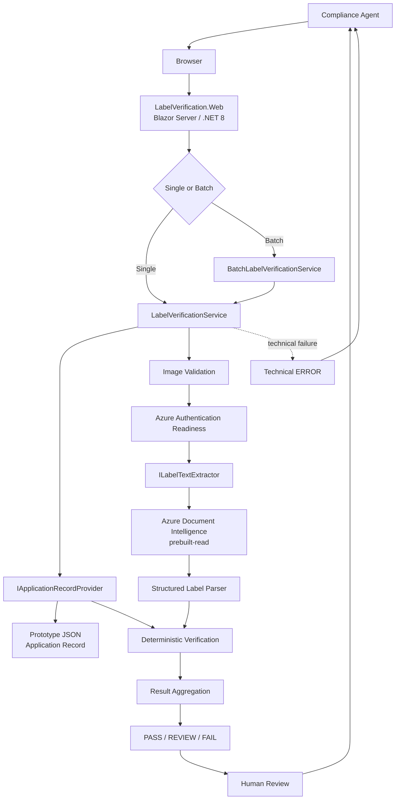
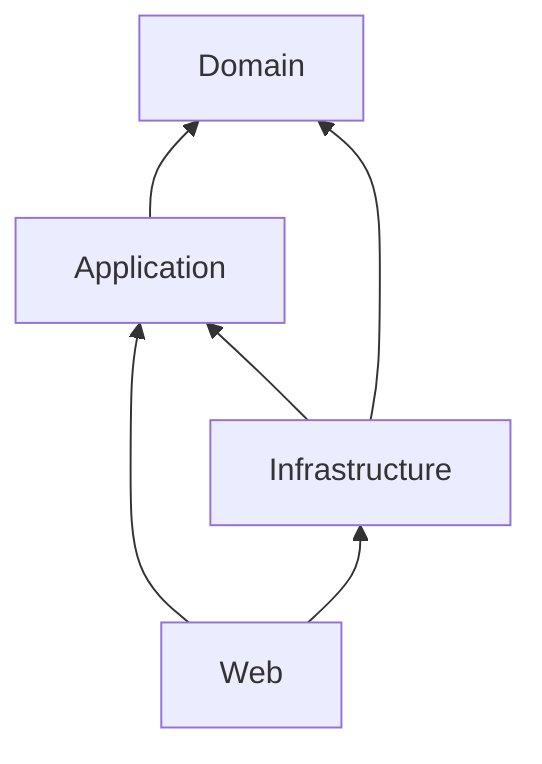
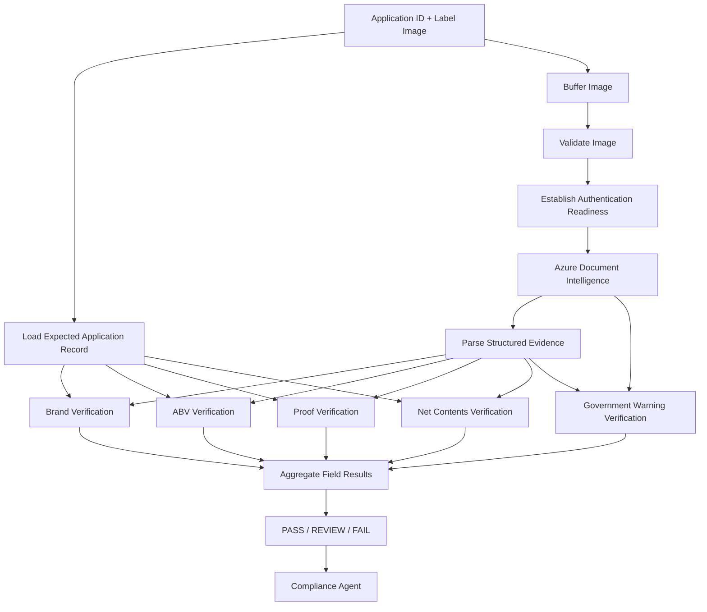
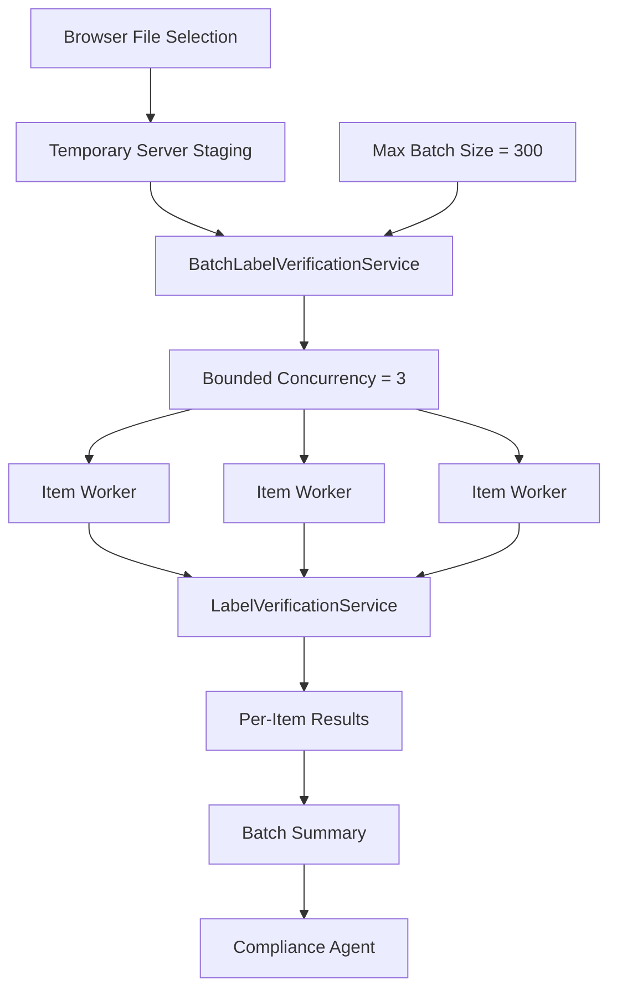
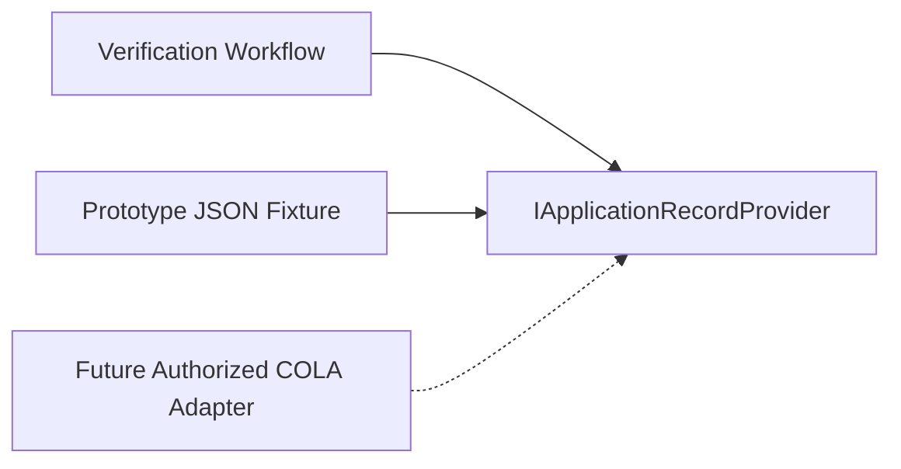
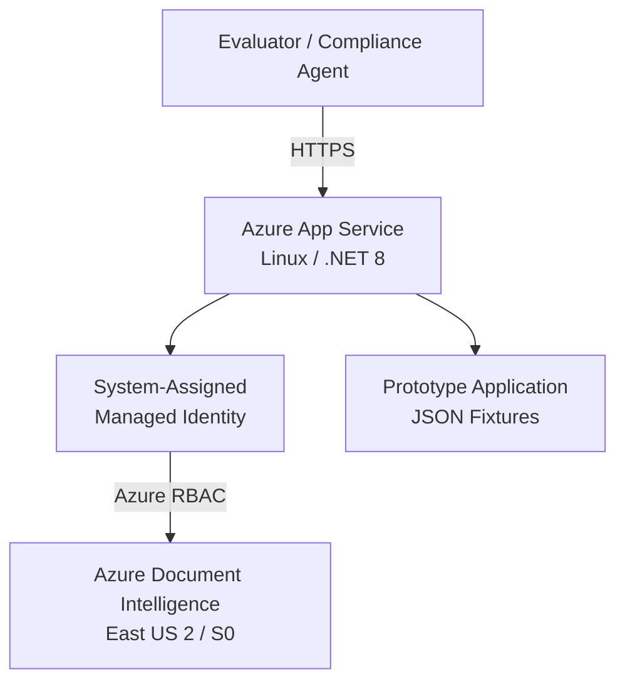
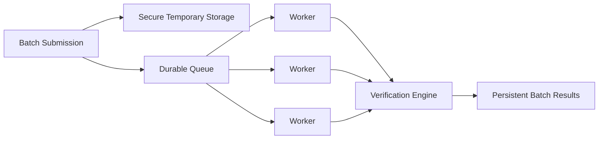

<!--
Application architecture for the evaluator prototype.

Maintenance guidance:
- Distinguish implemented prototype behavior from future production evolution.
- Do not describe durable queueing, COLA integration, private networking,
  or additional regulatory rules as implemented unless they actually exist.
- Keep technical ERROR separate from regulatory PASS / REVIEW / FAIL.
- Keep per-label latency separate from total batch wall-clock performance.
- Keep authentication-readiness timing separate from the five-second
  latency-sensitive OCR provider-operation timeout.
-->

# Application Architecture

## 1. Purpose

This document describes the implemented architecture of the **AI-Powered Alcohol Label Verification** prototype.

The application assists alcohol-label compliance reviewers by:

1. accepting one or more label images;
2. loading expected application data through an explicit adapter boundary;
3. establishing Azure authentication readiness;
4. extracting visible label evidence with Azure Document Intelligence;
5. converting OCR output into provider-neutral structured evidence;
6. applying deterministic field-specific verification rules;
7. aggregating supported results into `PASS`, `REVIEW`, or `FAIL`;
8. reporting technical processing problems separately as `ERROR`; and
9. presenting explainable evidence to a human compliance agent.

The central architectural principle is:

> **AI for perception and ambiguity; deterministic rules for objective compliance; human judgment for final compliance decisions.**

The prototype is intentionally standalone and does **not** integrate directly with the production COLA system.

---

## 2. Architectural Goals

The architecture is designed to support:

- an approximately five-second routine **per-label OCR provider-operation** target;
- bounded first-use authentication readiness;
- explainable field-level verification results;
- deterministic handling of objective compliance comparisons;
- human review when evidence is uncertain or incomplete;
- single-label and multi-label batch workflows;
- per-label fault isolation;
- bounded batch concurrency;
- independence between regulatory logic and OCR-provider technology;
- a clean future integration seam for COLA;
- Azure deployment without embedding service credentials;
- non-sensitive operational telemetry;
- deterministic automated testing without requiring live Azure services in normal CI;
- measurable single-label latency and batch throughput;
- future production security and network hardening without rewriting the verification engine.

The architecture deliberately separates **authentication readiness**, **perception**, **interpretation**, **verification**, **batch coordination**, and **final judgment**.

---

## 3. System Context



The browser does not communicate directly with Azure Document Intelligence.

Authentication and OCR requests are initiated server-side by the .NET application.

---

## 4. Solution Structure

The application is implemented as a layered modular monolith.

```text
src/
  LabelVerification.Domain/
  LabelVerification.Application/
  LabelVerification.Infrastructure/
  LabelVerification.Web/

tests/
  LabelVerification.UnitTests/
  LabelVerification.IntegrationTests/

tools/
  LabelVerification.Benchmarks/
```

Supporting assets include:

```text
sample-data/
benchmark-results/
infra/
docs/
```

This structure separates core verification behavior from external providers, user-interface concerns, batch coordination, test infrastructure, and deployment resources.

---

## 5. Layer Responsibilities

### 5.1 LabelVerification.Domain

The **Domain** project contains business concepts that should remain independent of:

- ASP.NET Core;
- Blazor;
- Azure SDKs;
- OCR providers;
- infrastructure configuration;
- external storage; and
- COLA implementation details.

The Domain layer represents the concepts required to express expected application data, detected evidence, and verification outcomes.

Conceptually, this layer answers:

> **What does the business problem mean?**

---

### 5.2 LabelVerification.Application

The **Application** project coordinates verification use cases.

Implemented responsibilities include:

- end-to-end single-label verification workflow orchestration;
- batch verification coordination;
- bounded batch concurrency;
- per-label batch fault isolation;
- batch progress reporting;
- batch correlation;
- OCR-provider abstractions;
- application-record-provider abstractions;
- structured label parsing;
- textual normalization;
- brand comparison;
- alcohol-by-volume verification;
- proof verification;
- net-contents verification;
- Government Warning verification;
- result aggregation;
- workflow-level performance telemetry.

The Application layer defines the capabilities required by the workflow while remaining independent of the concrete Azure OCR implementation.

The batch service deliberately delegates each item to the existing single-label service instead of duplicating regulatory rules.

Conceptually, this layer answers:

> **What does the system do?**

---

### 5.3 LabelVerification.Infrastructure

The **Infrastructure** project implements external technology boundaries.

Current responsibilities include:

- Azure Document Intelligence OCR;
- Azure Document Intelligence configuration;
- Azure credential integration;
- shared in-process access-token caching;
- authentication-readiness handling;
- JSON-backed prototype application data;
- implementation of Application-layer provider interfaces.

The OCR dependency is structured as:

```text
Application
    |
    v
ILabelTextExtractor
    |
    v
Infrastructure
    |
    +--> Shared TokenCredential
    |
    +--> Authentication Readiness
    |
    v
DocumentIntelligenceLabelTextExtractor
    |
    v
Azure Document Intelligence
```

The verification workflow therefore does not depend directly on Azure-specific OCR or authentication types.

Conceptually, Infrastructure answers:

> **How does the application communicate with external technology?**

---

### 5.4 LabelVerification.Web

The **Web** project provides the compliance-agent experience and acts as the application composition root.

Responsibilities include:

- single-label / batch mode selection;
- application-record selection;
- image upload;
- temporary batch upload staging;
- initiating verification;
- displaying field-level evidence;
- presenting `PASS`, `REVIEW`, `FAIL`, and technical `ERROR`;
- displaying processing telemetry;
- displaying batch progress;
- supporting PASS / REVIEW / FAIL / ERROR filtering;
- preserving human-review drill-down;
- HTTP request correlation;
- dependency-injection composition;
- ASP.NET Core request-pipeline configuration.

Regulatory comparison logic is intentionally kept out of Razor components.

The UI invokes Application-layer services instead of implementing verification rules directly.

---

## 6. Dependency Direction

The intended compile-time dependency direction is:

```text
Domain
  ↑
Application
  ↑
Infrastructure

Application
  ↑
Web

Infrastructure
  ↑
Web
```

Equivalent view:



The important constraints are:

- `Domain` remains independent.
- `Application` may depend on `Domain`.
- `Infrastructure` may depend on `Application` and `Domain`.
- `Web` may depend on `Application` and `Infrastructure`.
- `Application` does not depend on `Infrastructure`.
- `Domain` does not depend on `Application`, `Infrastructure`, or `Web`.

This prevents UI and provider-specific technology from leaking into core verification behavior.

---

## 7. Composition Root

The Web project assembles the runtime application using the built-in .NET dependency-injection container.

Conceptually:

```csharp
// Register Application-layer workflows, including single-label and batch
// verification services.
builder.Services
    .AddApplication()

    // Register Azure OCR, shared credential readiness, and prototype
    // application-data implementations.
    .AddInfrastructure(builder.Configuration);
```

`AddApplication()` registers Application-layer services.

`AddInfrastructure()` registers external implementations such as:

```text
JsonApplicationRecordProvider
CachingTokenCredential
DocumentIntelligenceLabelTextExtractor
DocumentIntelligenceClient
```

Batch options are supplied through configuration.

The evaluator prototype defaults to:

```text
MaxBatchSize = 300
MaxConcurrency = 3
```

Azure Document Intelligence timing defaults are:

```text
AuthenticationTimeoutSeconds = 15
TimeoutSeconds               = 5
```

These values remain configurable.

---

## 8. Single-Label Verification Pipeline

The implemented single-label verification pipeline is:



Invalid images are rejected before the external OCR provider is invoked.

Authentication readiness is established before the latency-sensitive five-second OCR provider-operation timeout begins.

The image is processed within a bounded workflow rather than persisted as a long-term application record.

---

## 9. Batch Verification Architecture

<!--
The batch coordinator is orchestration only.
It must not become a second implementation of regulatory verification rules.
-->

The batch workflow is built around the existing single-label verification operation.



### Batch Responsibilities

The implemented batch coordinator provides:

- maximum batch-size enforcement;
- bounded concurrency;
- per-label stream handling;
- input-order preservation in final results;
- per-label technical fault isolation;
- live progress snapshots;
- batch correlation;
- PASS / REVIEW / FAIL / ERROR summary counts.

It does **not** implement:

- brand rules;
- ABV rules;
- proof rules;
- net-content rules;
- Government Warning rules.

Those remain in the existing verification workflow.

---

## 10. Batch Processing States

Batch processing distinguishes technical workflow state from regulatory result.

### Technical Processing State

```text
Pending
Processing
Completed
Error
```

### Regulatory Result

```text
PASS
REVIEW
FAIL
```

A processing `Error` is not equivalent to regulatory `FAIL`.

For example:

```text
Item 1
ProcessingStatus = Completed
RegulatoryStatus = PASS

Item 2
ProcessingStatus = Error
RegulatoryStatus = none

Item 3
ProcessingStatus = Completed
RegulatoryStatus = REVIEW
```

This distinction prevents infrastructure problems from being represented as regulatory findings.

---

## 11. Per-Item Fault Isolation

A failure affecting one label does not stop independent items from completing where possible.

Mapped technical error categories include:

```text
OCR_FAILURE
APPLICATION_DATA_INVALID
IMAGE_READ_FAILURE
UNEXPECTED_ERROR
```

The batch coordinator also preserves technical failures returned directly by the underlying single-label workflow.

Authentication-readiness or OCR-provider failures therefore become technical item errors rather than regulatory failures.

The batch summary reports those items as `ERROR`, separate from PASS / REVIEW / FAIL.

---

## 12. Temporary Batch Upload Staging

Blazor Server exposes uploaded files through browser-backed streams.

Those streams are appropriate for normal upload transfer, but they are not used as concurrent OCR-worker streams.

The batch UI therefore performs a staging step:

```text
Browser File
    |
    v
Sequential Server Upload
    |
    v
Random Temporary File
    |
    v
Normal FileStream
    |
    v
Batch Worker
```

The temporary staging design provides:

- ordinary server-side `FileStream` inputs for concurrent workers;
- isolation from Blazor remote-stream timing behavior;
- no dependency on browser-stream lifetime during OCR execution.

Temporary files are deleted in cleanup logic after batch execution.

The current prototype does not provide durable document persistence.

---

## 13. AI Boundary

Azure Document Intelligence is used for **perception**.

The OCR provider supplies evidence such as:

- detected text;
- lines and words;
- confidence information;
- supported font-style information.

Provider-specific output is converted into application-owned models before verification rules are applied.

Azure Document Intelligence does **not** determine whether a label is compliant.

The authority boundary is:

```text
Label Image
    |
    v
Azure Authentication Readiness
    |
    v
AI / OCR Perception
    |
    v
Structured Evidence
    |
    v
Deterministic Rules
    |
    v
PASS / REVIEW / FAIL
    |
    v
Human Compliance Judgment
```

This is a deliberate architecture decision.

---

## 14. Verification Coverage

Current implemented verification coverage is:

| Field | Verification Strategy | Included in Overall Aggregate |
|---|---|---|
| Brand name | Normalization + controlled fuzzy comparison | Yes |
| Class / type | Extracted and parsed | **No** |
| Alcohol by volume | Deterministic numeric comparison | Yes |
| Proof | Deterministic numeric comparison | Yes |
| Net contents | Normalized value/unit comparison | Yes |
| Government Warning | Deterministic supported wording/presentation rules | Yes |

### Class / Type Boundary

Class/type is present in the application contract and is extracted and parsed from label evidence.

It is **not currently included in the automated aggregate verification result**.

This limitation is intentionally documented rather than represented as completed functionality.

---

## 15. Verification Semantics

Different fields require different comparison strategies.

### Brand Name

Brand comparison supports normalization and controlled fuzzy matching.

For example:

```text
Application:
Stone's Throw

Detected:
STONE'S THROW

Normalized:
stones throw
stones throw
```

Case and punctuation differences do not automatically produce a false failure.

A similarity result that is plausible but not sufficiently strong can produce `REVIEW`.

### Alcohol by Volume

ABV is evaluated through deterministic numeric comparison with the expected application value.

### Proof

Proof is evaluated through deterministic numeric comparison when represented in the application record.

### Net Contents

Net contents are compared after supported unit normalization.

### Government Warning

Government Warning validation is modeled as a regulatory rule rather than application-specific expected data.

Supported checks include:

- warning presence;
- warning wording;
- required heading capitalization;
- supported typography evidence where the OCR provider supplies adequate evidence.

Ambiguous visual evidence is routed to `REVIEW`.

---

## 16. Decision Model

### PASS

`PASS` is used when the supported automated checks have sufficient evidence and applicable deterministic comparisons pass.

### REVIEW

`REVIEW` is used when the system cannot make a defensible automated determination.

Examples include:

- fuzzy brand similarity;
- missing or incomplete OCR evidence;
- image-quality uncertainty;
- insufficient typography evidence;
- ambiguous extracted values.

### FAIL

`FAIL` is used when available evidence clearly supports a supported mismatch or regulatory-rule failure.

### ERROR

`ERROR` represents a technical processing problem.

Examples include:

- authentication-readiness failure;
- OCR provider failure;
- image-read failure;
- invalid application data;
- unexpected processing exception.

`ERROR` does not manufacture a regulatory outcome.

### Human Authority

The automated result is decision-support evidence.

The compliance agent remains the final decision authority.

---

## 17. COLA Boundary

COLA is treated as an upstream system of record.

The Application layer defines:

```text
IApplicationRecordProvider
```

The current prototype implementation is:

```text
JsonApplicationRecordProvider
```

A future authorized implementation could provide:

```text
ColaApplicationRecordProvider
```

without changing deterministic verification rules.



The prototype does not:

- call production COLA;
- modify COLA records;
- invent an undocumented production COLA API;
- claim knowledge of COLA's internal implementation.

The adapter exists specifically to preserve that boundary.

---

## 18. Azure Document Intelligence

The implemented OCR provider is Azure Document Intelligence.

Current configuration uses:

```text
Model:                          prebuilt-read
Authentication readiness:      15-second timeout
OCR provider operation:        5-second timeout
Font-style extraction:         enabled
```

The Azure SDK client is registered by the Infrastructure layer.

The application uses the OCR abstraction rather than consuming Azure-specific response types throughout the verification engine.

The five-second timeout applies to the latency-sensitive provider operation **after authentication readiness succeeds**.

Authentication readiness has its own bounded timeout so startup credential discovery or token acquisition does not consume the OCR provider-operation budget.

This allows another OCR provider to be introduced later if needed.

---

## 19. Azure Authentication Readiness

<!--
This section documents the implemented startup-readiness mitigation.
It does not claim authentication was proven to be the only source of all
first-use latency.
-->

The Infrastructure layer creates one shared Azure `TokenCredential`.

That credential is used by both:

1. the explicit authentication-readiness step; and
2. the Azure Document Intelligence client.

The credential is wrapped by an in-process caching credential.

Conceptually:

```text
DefaultAzureCredential
        |
        v
CachingTokenCredential
        |
        +--> Authentication readiness check
        |
        +--> DocumentIntelligenceClient
```

Concurrent first-use batch workers request the same Cognitive Services scope.

The cache and synchronization gate ensure one valid token acquisition can be reused by subsequent workers rather than initiating independent credential discovery flows.

The access token remains only in process memory.

It is not written to:

- application configuration;
- logs;
- files;
- persistent storage.

### Timeout Separation

The timing model is:

```text
Authentication readiness
    |
    | maximum 15 seconds
    v
Valid Azure access token
    |
    v
OCR provider operation
    |
    | maximum 5 seconds
    v
OCR evidence
```

This does not make startup latency disappear.

Application-layer timing still wraps the complete OCR extractor invocation, and batch wall-clock timing still exposes startup cost.

The separation ensures startup authentication does not automatically consume the normal five-second provider-operation budget.

---

## 20. Azure Deployment Topology

The evaluator-accessible prototype is deployed to Azure App Service.



Implemented deployment characteristics include:

- Azure App Service for Linux;
- .NET 8 runtime;
- HTTPS-only access;
- Always On enabled;
- Azure Document Intelligence in East US 2;
- S0 Document Intelligence SKU;
- system-assigned Managed Identity;
- scoped `Cognitive Services User` role;
- infrastructure represented through Bicep.

---

## 21. Identity and Secret Management

The deployed application authenticates to Azure Document Intelligence using:

```text
System-Assigned Managed Identity
+
Azure RBAC
```

The application does not require a Cognitive Services API key in application configuration.

Local development uses:

```text
DefaultAzureCredential
```

The credential is wrapped by an in-process cache shared by the readiness step and Azure Document Intelligence client.

This allows developer identity and hosted workload identity to use the same provider abstraction.

The browser never receives OCR credentials.

---

## 22. Prototype Network Boundary

The evaluator-accessible prototype currently uses the public Azure Document Intelligence endpoint.

This is an intentional prototype trade-off.

It allows an external evaluator to exercise the application without Treasury internal-network dependencies.

A production architecture could evolve toward:

```text
Azure App Service
    |
    v
VNet Integration
    |
    v
Private DNS
    |
    v
Private Endpoint
    |
    v
Azure Document Intelligence
```

Production hardening could additionally include:

- public AI access disabled;
- firewall restrictions;
- NSG controls;
- private service connectivity;
- centralized monitoring and audit controls.

These are production-evolution paths, not claims about the current prototype.

---

## 23. Observability

The verification workflow emits non-sensitive operational telemetry.

Current single-label workflow telemetry includes:

```text
CorrelationId
OcrDuration
VerificationDuration
TotalDuration
ResultCategory
ErrorCategory
```

Batch processing additionally provides:

```text
BatchCorrelationId
TotalItems
CompletedItems
PassCount
ReviewCount
FailCount
ErrorCount
ItemId
ItemProcessingStatus
CompletedItemResult
```

Each successfully invoked underlying single-label workflow retains its own verification correlation identifier.

This creates two useful scopes:

```text
BatchCorrelationId
    |
    +--> Item Verification CorrelationId
    +--> Item Verification CorrelationId
    +--> Item Verification CorrelationId
```

The Web layer separately supports HTTP request correlation.

The workflow does not intentionally log document contents as operational telemetry.

Examples of excluded information include:

```text
image bytes
OCR document text
parsed label contents
Government Warning contents
uploaded filenames
```

Synthetic fixture filenames may appear in benchmark evidence for reproducibility. They are not production document telemetry.

---

## 24. Timing Boundaries

### Authentication Readiness

Measures startup work required to obtain or reuse an Azure Cognitive Services access token.

The readiness operation is bounded by:

```text
AuthenticationTimeout = 15 seconds
```

The readiness timeout is separate from the normal OCR provider-operation target.

### OCR Provider Operation

After authentication readiness succeeds, the Azure Document Intelligence provider operation is bounded by:

```text
OcrProviderTimeout = 5 seconds
```

This includes the latency-sensitive Azure Document Intelligence request/poll/result operation.

### Application OCR Duration

Application telemetry surrounds the complete OCR extractor invocation.

Therefore:

```text
Application OcrDuration
=
Authentication readiness
+
OCR provider operation
```

This intentionally keeps startup cost visible.

### Verification Duration

Measures deterministic work after OCR, including:

- structured parsing;
- field comparisons;
- supported regulatory checks;
- result aggregation.

### Total Duration

Measures the complete Application-layer single-label verification workflow.

### Batch Item Duration

Measures one item's independent execution through the batch coordinator and existing single-label workflow.

### Batch Wall Time

Measures total elapsed time for a complete measured batch.

### Batch Throughput

Measured separately as:

```text
labels completed / batch wall-clock duration
```

Browser rendering, browser upload time, temporary staging transfer time, and human-review time are not included in the service-throughput benchmark.

---

## 25. Measured Single-Label Performance

The formal warm-state benchmark used five representative synthetic label fixtures across ten measured iterations each.

```text
5 fixtures
×
10 measured iterations
=
50 measured observations
```

One five-image warm-up pass was excluded from formal statistics.

Measured results:

| Metric | Result |
|---|---:|
| Measured observations | 50 |
| Successful workflows | 50 / 50 |
| OCR timeouts during measured phase | 0 |
| Attempts within approximately five seconds | 50 / 50 |
| Median observed latency | 2.201 s |
| P95 observed latency | 2.620 s |
| Worst observed latency | 3.277 s |
| Median OCR latency | 2.201 s |
| P95 OCR latency | 2.619 s |
| Worst OCR latency | 3.276 s |
| Median deterministic verification latency | < 1 ms |

OCR accounts for nearly all measured steady-state processing time.

The benchmark therefore validates that deterministic parsing, comparison, and aggregation are not the dominant latency contributors.

---

## 26. Measured Batch Performance

<!--
Do not combine total batch wall time with the approximately five-second
per-label provider-operation target. These are intentionally separate
performance dimensions.
-->

The final formal batch benchmark used:

```text
30 labels per batch
3 measured batches
3 maximum concurrent workers
90 formal label attempts
```

A six-label concurrent warm-up batch was excluded from formal measurements.

### Final Formal Results

| Metric | Result |
|---|---:|
| Measured batches | 3 |
| Labels per batch | 30 |
| Formal label attempts | 90 |
| Returned item results | 90 / 90 |
| Technical errors | 0 |
| Per-label attempts within five seconds | 90 / 90 |
| Median item duration | 2.213 s |
| P95 item duration | 2.396 s |
| Worst item duration | 3.239 s |
| Median 30-label batch wall time | 23.038 s |
| P95 30-label batch wall time | 23.747 s |
| Median throughput | 78.1 labels/min |
| P95 measured throughput | 79.8 labels/min |

Measured regulatory outcomes:

```text
PASS   = 36
REVIEW = 18
FAIL   = 36
ERROR  = 0
```

These regulatory counts result from the intentionally mixed synthetic fixture pool.

They are not an application accuracy percentage.

### Excluded Warm-Up Batch

The final excluded warm-up batch produced:

```text
6 requested
6 returned
0 errors
10.739 s wall time
33.5 labels/min
```

The warm-up remained materially slower than steady-state processing.

That startup cost remains visible even though authentication readiness is now separated from the normal five-second OCR provider-operation timeout.

### Performance Interpretation

The stakeholder's approximately five-second target is evaluated **per label** for the normal provider operation.

It is not applied to a complete high-volume batch.

Therefore:

```text
Per-label provider-operation target
        !=
Complete batch wall-clock target
```

Batch performance is reported through:

- batch wall time;
- labels per minute;
- per-item latency;
- technical error rate.

Benchmark implementation and evidence are maintained under:

```text
tools/LabelVerification.Benchmarks/
benchmark-results/
```

---

## 27. First-Use Performance Behavior

Earlier diagnostics identified a first-use/warm-up effect in the end-to-end OCR path.

Before authentication readiness was separated from the five-second OCR provider-operation timeout, early concurrent requests could reach the timeout boundary during startup.

The observed failures followed **request position** rather than remaining associated with specific label fixtures.

That behavior supported the interpretation of a startup/readiness issue rather than an image-specific OCR defect.

The prototype does **not** claim that authentication was proven to be the sole contributor to all startup latency.

Possible contributors include:

- credential discovery;
- token acquisition;
- .NET runtime or JIT initialization;
- Azure SDK initialization;
- connection establishment;
- TLS setup;
- network variability;
- service-side processing variability.

### Implemented Mitigation

The final implementation:

1. creates one shared Azure credential;
2. caches a valid access token in process;
3. serializes concurrent token refresh;
4. establishes authentication readiness before OCR execution;
5. bounds authentication readiness at 15 seconds;
6. preserves the normal five-second Azure Document Intelligence provider-operation timeout; and
7. continues measuring startup cost through Application telemetry and batch wall-clock timing.

### Final Validation Evidence

The post-mitigation live batch smoke test produced:

```text
Warm-up:
6 / 6 returned
0 technical errors

Measured smoke batch:
3 / 3 returned
0 technical errors
3 / 3 within five seconds
```

The final formal batch benchmark produced:

```text
Warm-up:
6 / 6 returned
0 technical errors

Formal measured phase:
90 / 90 returned
0 technical errors
90 / 90 within five seconds
```

This evidence supports the startup-readiness mitigation without asserting that authentication was conclusively the only possible source of first-use latency.

---

## 28. Testing Architecture

The current solution baseline contains:

```text
192 passed
0 failed
```

### Unit Tests

Unit tests exercise deterministic verification behavior without requiring a live Azure dependency.

Representative areas include:

```text
text normalization
brand comparison
ABV verification
proof verification
net-contents normalization
Government Warning validation
result aggregation
structured parsing
batch validation
bounded batch concurrency
batch result ordering
batch fault isolation
technical error separation
batch progress
batch correlation
cancellation propagation
```

### Integration Tests

Integration tests validate the real Application-layer composition while substituting controlled OCR evidence.

This allows deterministic verification of:

- application-record loading;
- image validation;
- parsing;
- verification rules;
- aggregation;
- failure paths;
- telemetry;
- sensitive-log protections;
- batch execution;
- mixed PASS / REVIEW / FAIL outcomes;
- per-item fault isolation;
- batch technical-error separation;
- batch progress and correlation.

### Live OCR Test

Azure Document Intelligence has a separate opt-in live integration test.

The live test exercises the same shared-credential and authentication-readiness pattern used by the production Infrastructure implementation.

Normal CI intentionally disables live OCR so external-service latency or transient availability does not gate deterministic application behavior.

### Benchmark Harness

Performance benchmarking is isolated under:

```text
tools/LabelVerification.Benchmarks/
```

The harness supports:

```text
single-label benchmark
batch benchmark
```

Live performance benchmarking is not part of normal CI.

---

## 29. Error Handling

Technical processing failures are treated separately from compliance outcomes.

Examples include:

```text
missing application selection
missing image
application record not found
invalid image
authentication readiness timeout
authentication failure
OCR timeout
OCR provider failure
image read failure
invalid application data
unexpected batch item failure
```

A technical failure does not manufacture a regulatory `PASS` or `FAIL`.

When the application successfully receives evidence but that evidence is ambiguous, `REVIEW` is preferred.

In batch mode, isolated technical failures are represented as per-item `ERROR` results.

---

## 30. Security Boundary

Implemented prototype controls include:

- HTTPS-only application access;
- Azure Managed Identity;
- scoped Azure RBAC;
- no OCR API key required in application configuration;
- shared in-process Azure credential/token reuse;
- bounded authentication-readiness timeout;
- bounded OCR provider-operation timeout;
- upload validation;
- configurable maximum batch size;
- bounded batch concurrency;
- randomly named temporary batch staging files;
- staged-file cleanup;
- per-item batch fault isolation;
- non-sensitive operational telemetry;
- no required long-term storage of submitted label images.

The in-process token cache is not persisted.

The prototype does **not** claim to implement:

- production federal SSO;
- production role-based user authorization;
- a production Authority to Operate;
- every FedRAMP control;
- production records-management policy;
- full Treasury private-network topology;
- complete production PII-handling controls.

Those remain production-evolution concerns.

---

## 31. Batch Production Evolution

The evaluator prototype intentionally uses bounded in-process batch coordination.

It does **not** currently implement:

```text
Azure Service Bus
durable queueing
persistent batch jobs
scheduled processing
email completion notification
distributed workers
long-term image storage
```

A production batch architecture could evolve toward:



Potential production additions include:

- durable messaging;
- secure object storage;
- retry policies;
- persistent job state;
- horizontal worker scaling;
- distributed concurrency controls;
- operational dashboards;
- scheduled cleanup;
- completion notifications.

The existing single-label verification engine would remain reusable inside that model.

---

## 32. Known Architectural Limitations

Current architectural and functional boundaries include:

- class/type is extracted and parsed but not included in the automated aggregate;
- no direct production COLA integration;
- no production federal identity integration;
- batch coordination is in-process rather than durable;
- in-flight batch state is not persisted across process restarts;
- temporary batch staging uses local server storage;
- no complete beverage-specific regulatory coverage;
- no required long-term document persistence;
- typography verification is limited to evidence exposed by the OCR provider;
- first-use end-to-end startup can remain slower than steady-state processing even though authentication readiness and OCR execution have separate bounded timeout budgets;
- Application-layer and service-throughput metrics do not include browser upload time;
- final compliance authority remains human.

These limitations are documented explicitly to distinguish implemented prototype behavior from future production capability.

---

## 33. Architecture Decision Records

Architecture decisions are maintained under:

```text
docs/decisions/
```

Current records are:

```text
0001-layered-architecture.md
0002-hybrid-verification-strategy.md
0003-cola-adapter-boundary.md
0004-azure-document-intelligence.md
0005-managed-identity-and-rbac.md
0006-verification-telemetry.md
```

The ADRs preserve the context, decision, trade-offs, and consequences behind significant engineering choices.

---

## 34. Architectural Principles

1. **AI is used for perception, not final regulatory authority.**
2. **Objective compliance comparisons remain deterministic where feasible.**
3. **Ambiguous evidence becomes REVIEW rather than unsupported certainty.**
4. **Technical ERROR remains separate from regulatory FAIL.**
5. **The compliance agent remains the final decision authority.**
6. **Batch processing reuses the existing single-label verification workflow.**
7. **Batch concurrency is bounded rather than unrestricted.**
8. **Per-item failures are isolated where possible.**
9. **Authentication readiness is separated from the normal OCR provider-operation timeout.**
10. **First-use startup cost remains measurable rather than hidden.**
11. **External providers are hidden behind Application-layer abstractions.**
12. **COLA remains an upstream boundary rather than a prototype dependency.**
13. **Infrastructure technology remains outside the Domain layer.**
14. **Managed Identity and scoped RBAC are preferred over application secrets.**
15. **Operational telemetry excludes document contents.**
16. **Performance claims are based on measured evidence.**
17. **Per-label latency and batch throughput are reported separately.**
18. **Prototype and production capabilities are documented separately.**
19. **Known limitations are explicit rather than hidden.**

---

## 35. Summary

The prototype is intentionally designed as a small, explainable, testable compliance-assistance system rather than an autonomous AI decision engine.

Its primary architectural separation is:

```text
Azure Authentication Readiness
    ↓
AI / OCR
    ↓
Evidence
    ↓
Deterministic Verification
    ↓
PASS / REVIEW / FAIL
    ↓
Human Judgment
```

Batch processing adds orchestration around that same core:

```text
Multiple Label Inputs
    ↓
Bounded Batch Coordination
    ↓
Independent Existing Verification Workflows
    ↓
PASS / REVIEW / FAIL / ERROR per item
    ↓
Batch Summary + Human Review
```

That boundary allows the prototype to demonstrate meaningful automation while preserving traceability, testability, regulatory explainability, per-label fault isolation, bounded startup behavior, measurable performance, and a clear path toward future production integration.