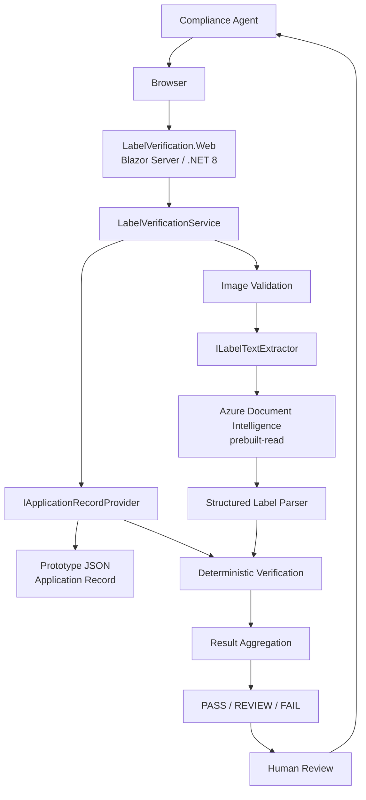
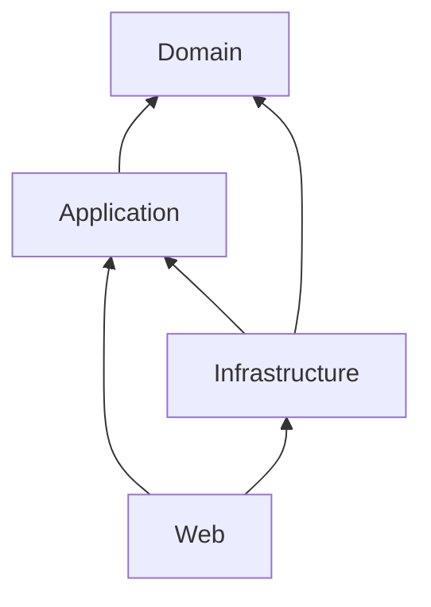
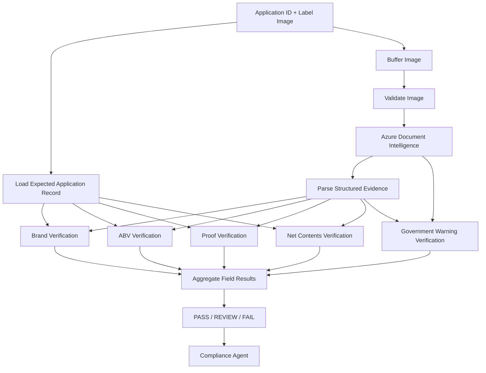
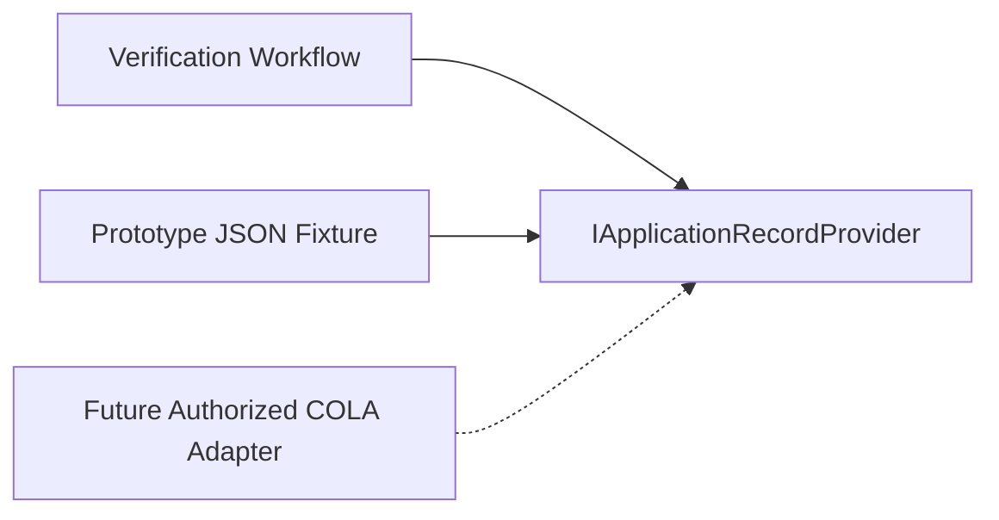
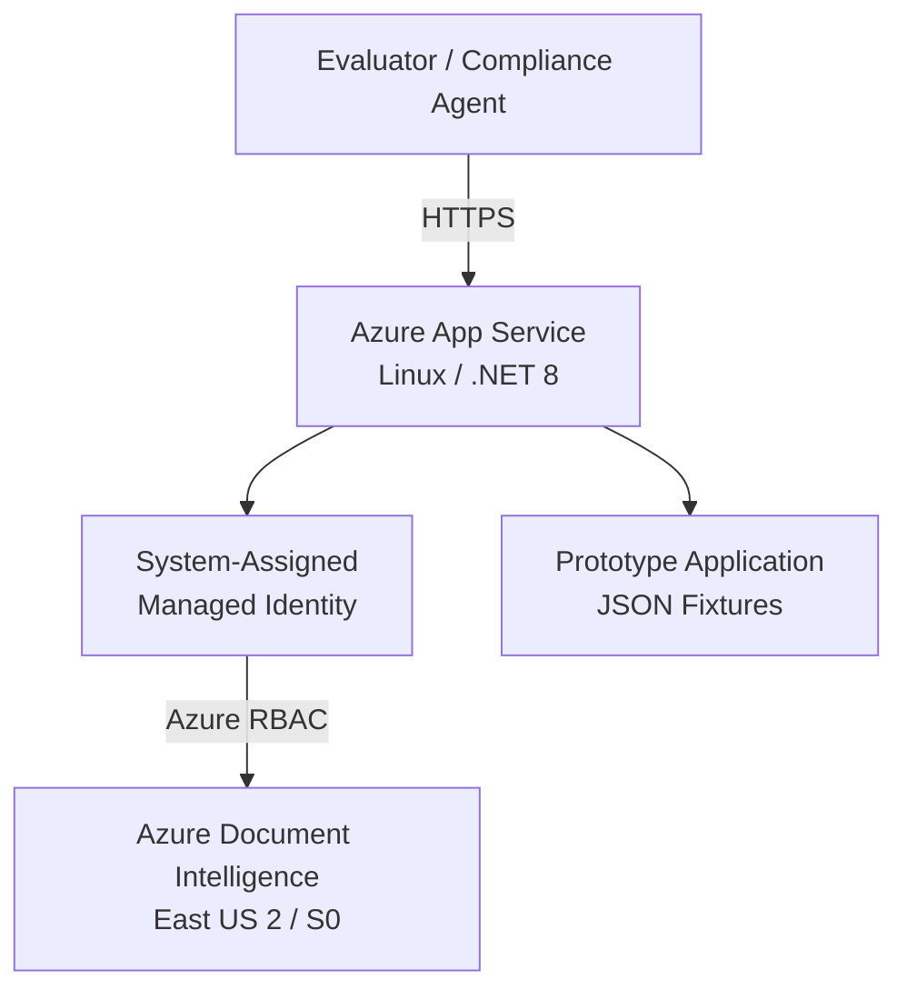
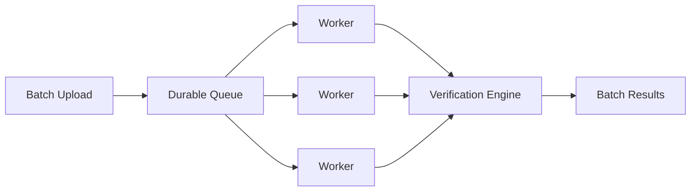

# Application Architecture

## 1. Purpose

This document describes the implemented architecture of the **AI-Powered Alcohol Label Verification** prototype.

The application assists alcohol-label compliance reviewers by:

1. accepting a label image;
2. loading expected application data through an explicit adapter boundary;
3. extracting visible label evidence with Azure Document Intelligence;
4. converting OCR output into provider-neutral structured evidence;
5. applying deterministic field-specific verification rules;
6. aggregating results into `PASS`, `REVIEW`, or `FAIL`; and
7. presenting explainable evidence to a human compliance agent.

The central architectural principle is:

> **AI for perception and ambiguity; deterministic rules for objective compliance; human judgment for final compliance decisions.**

The prototype is intentionally standalone and does **not** integrate directly with the production COLA system.

---

## 2. Architectural Goals

The architecture is designed to support:

- an approximately five-second routine verification target;
- explainable field-level verification results;
- deterministic handling of objective compliance comparisons;
- human review when evidence is uncertain or incomplete;
- independence between regulatory logic and OCR-provider technology;
- a clean future integration seam for COLA;
- Azure deployment without embedding service credentials;
- non-sensitive operational telemetry;
- deterministic automated testing without requiring live Azure services in normal CI;
- future production security and network hardening without rewriting the verification engine.

The architecture deliberately separates **perception**, **interpretation**, **verification**, and **final judgment**.

---

## 3. System Context



The browser does not communicate directly with Azure Document Intelligence.

OCR requests are initiated server-side by the .NET application.

---

## 4. Solution Structure

The application is implemented as a layered modular monolith.

```text
src/
  LabelVerification.Domain/
  LabelVerification.Application/
  LabelVerification.Infrastructure/
  LabelVerification.Web/

tests/
  LabelVerification.UnitTests/
  LabelVerification.IntegrationTests/

tools/
  LabelVerification.Benchmarks/
```

Supporting assets include:

```text
sample-data/
benchmark-results/
infra/
docs/
```

This structure separates core verification behavior from external providers, user-interface concerns, test infrastructure, and deployment resources.

---

## 5. Layer Responsibilities

### 5.1 LabelVerification.Domain

The **Domain** project contains business concepts that should remain independent of:

- ASP.NET Core;
- Blazor;
- Azure SDKs;
- OCR providers;
- infrastructure configuration;
- external storage; and
- COLA implementation details.

The Domain layer represents the concepts required to express expected application data, detected evidence, and verification outcomes.

Conceptually, this layer answers:

> **What does the business problem mean?**

---

### 5.2 LabelVerification.Application

The **Application** project coordinates the verification use case.

Implemented responsibilities include:

- end-to-end verification workflow orchestration;
- OCR-provider abstractions;
- application-record-provider abstractions;
- structured label parsing;
- textual normalization;
- brand comparison;
- alcohol-by-volume verification;
- proof verification;
- net-contents verification;
- Government Warning verification;
- result aggregation;
- workflow-level performance telemetry.

The Application layer defines the capabilities required by the workflow while remaining independent of the concrete Azure OCR implementation.

Conceptually, this layer answers:

> **What does the system do?**

---

### 5.3 LabelVerification.Infrastructure

The **Infrastructure** project implements external technology boundaries.

Current responsibilities include:

- Azure Document Intelligence OCR;
- Azure Document Intelligence configuration;
- credential integration;
- JSON-backed prototype application data;
- implementation of Application-layer provider interfaces.

The OCR dependency is structured as:

```text
Application
    |
    v
ILabelTextExtractor
    |
    v
Infrastructure
    |
    v
DocumentIntelligenceLabelTextExtractor
    |
    v
Azure Document Intelligence
```

The verification workflow therefore does not depend directly on Azure-specific OCR types.

Conceptually, Infrastructure answers:

> **How does the application communicate with external technology?**

---

### 5.4 LabelVerification.Web

The **Web** project provides the compliance-agent experience and acts as the application composition root.

Responsibilities include:

- application-record selection;
- image upload;
- initiating verification;
- displaying field-level evidence;
- presenting `PASS`, `REVIEW`, and `FAIL`;
- displaying processing telemetry;
- supporting the human-review workflow;
- HTTP request correlation;
- dependency-injection composition;
- ASP.NET Core request-pipeline configuration.

Regulatory comparison logic is intentionally kept out of Razor components.

The UI invokes Application-layer services instead of implementing verification rules directly.

---

## 6. Dependency Direction

The intended compile-time dependency direction is:

```text
Domain
  ↑
Application
  ↑
Infrastructure

Application
  ↑
Web

Infrastructure
  ↑
Web
```

Equivalent view:



The important constraints are:

- `Domain` remains independent.
- `Application` may depend on `Domain`.
- `Infrastructure` may depend on `Application` and `Domain`.
- `Web` may depend on `Application` and `Infrastructure`.
- `Application` does not depend on `Infrastructure`.
- `Domain` does not depend on `Application`, `Infrastructure`, or `Web`.

This prevents UI and provider-specific technology from leaking into core verification behavior.

---

## 7. Composition Root

The Web project assembles the runtime application using the built-in .NET dependency-injection container.

Conceptually:

```csharp
builder.Services
    .AddApplication()
    .AddInfrastructure(builder.Configuration);
```

`AddApplication()` registers Application-layer services.

`AddInfrastructure()` registers external implementations such as:

```text
JsonApplicationRecordProvider
DocumentIntelligenceLabelTextExtractor
DocumentIntelligenceClient
```

This keeps provider selection outside the verification workflow.

---

## 8. Verification Pipeline

The implemented verification pipeline is:



Invalid images are rejected before the external OCR provider is invoked.

The image is processed within a bounded workflow rather than persisted as a long-term application record.

---

## 9. AI Boundary

Azure Document Intelligence is used for **perception**.

The OCR provider supplies evidence such as:

- detected text;
- lines and words;
- confidence information;
- supported font-style information.

Provider-specific output is converted into application-owned models before verification rules are applied.

Azure Document Intelligence does **not** determine whether a label is compliant.

The authority boundary is:

```text
Label Image
    |
    v
AI / OCR Perception
    |
    v
Structured Evidence
    |
    v
Deterministic Rules
    |
    v
PASS / REVIEW / FAIL
    |
    v
Human Compliance Judgment
```

This is a deliberate architecture decision.

---

## 10. Verification Coverage

Current implemented verification coverage is:

| Field | Verification Strategy | Included in Overall Aggregate |
|---|---|---|
| Brand name | Normalization + controlled fuzzy comparison | Yes |
| Class / type | Extracted and parsed | **No** |
| Alcohol by volume | Deterministic numeric comparison | Yes |
| Proof | Deterministic numeric comparison | Yes |
| Net contents | Normalized value/unit comparison | Yes |
| Government Warning | Deterministic supported wording/presentation rules | Yes |

### Class / Type Boundary

Class/type is present in the application contract and is extracted and parsed from label evidence.

It is **not currently included in the automated aggregate verification result**.

This limitation is intentionally documented rather than represented as completed functionality.

---

## 11. Verification Semantics

Different fields require different comparison strategies.

### Brand Name

Brand comparison supports normalization and controlled fuzzy matching.

For example:

```text
Application:
Stone's Throw

Detected:
STONE'S THROW

Normalized:
stones throw
stones throw
```

Case and punctuation differences do not automatically produce a false failure.

A similarity result that is plausible but not sufficiently strong can produce `REVIEW`.

### Alcohol by Volume

ABV is evaluated through deterministic numeric comparison with the expected application value.

### Proof

Proof is evaluated through deterministic numeric comparison when represented in the application record.

### Net Contents

Net contents are compared after supported unit normalization.

### Government Warning

Government Warning validation is modeled as a regulatory rule rather than application-specific expected data.

Supported checks include:

- warning presence;
- warning wording;
- required heading capitalization;
- supported typography evidence where the OCR provider supplies adequate evidence.

Ambiguous visual evidence is routed to `REVIEW`.

---

## 12. Decision Model

### PASS

`PASS` is used when the supported automated checks have sufficient evidence and applicable deterministic comparisons pass.

### REVIEW

`REVIEW` is used when the system cannot make a defensible automated determination.

Examples include:

- fuzzy brand similarity;
- missing or incomplete OCR evidence;
- image-quality uncertainty;
- insufficient typography evidence;
- ambiguous extracted values.

### FAIL

`FAIL` is used when available evidence clearly supports a supported mismatch or regulatory-rule failure.

### Human Authority

The automated result is decision-support evidence.

The compliance agent remains the final decision authority.

---

## 13. COLA Boundary

COLA is treated as an upstream system of record.

The Application layer defines:

```text
IApplicationRecordProvider
```

The current prototype implementation is:

```text
JsonApplicationRecordProvider
```

A future authorized implementation could provide:

```text
ColaApplicationRecordProvider
```

without changing deterministic verification rules.



The prototype does not:

- call production COLA;
- modify COLA records;
- invent an undocumented production COLA API;
- claim knowledge of COLA's internal implementation.

The adapter exists specifically to preserve that boundary.

---

## 14. Azure Document Intelligence

The implemented OCR provider is Azure Document Intelligence.

Current configuration uses:

```text
Model: prebuilt-read
OCR timeout: 5 seconds
Font-style extraction: enabled
```

The Azure SDK client is registered by the Infrastructure layer.

The application uses the OCR abstraction rather than consuming Azure-specific response types throughout the verification engine.

This allows another OCR provider to be introduced later if needed.

---

## 15. Azure Deployment Topology

The evaluator-accessible prototype is deployed to Azure App Service.



Implemented deployment characteristics include:

- Azure App Service for Linux;
- .NET 8 runtime;
- HTTPS-only access;
- Always On enabled;
- Azure Document Intelligence in East US 2;
- S0 Document Intelligence SKU;
- system-assigned Managed Identity;
- scoped `Cognitive Services User` role;
- infrastructure represented through Bicep.

---

## 16. Identity and Secret Management

The deployed application authenticates to Azure Document Intelligence using:

```text
System-Assigned Managed Identity
+
Azure RBAC
```

The application does not require a Cognitive Services API key in application configuration.

Local development uses:

```text
DefaultAzureCredential
```

This allows developer identity and hosted workload identity to use the same provider abstraction.

The browser never receives OCR credentials.

---

## 17. Prototype Network Boundary

The evaluator-accessible prototype currently uses the public Azure Document Intelligence endpoint.

This is an intentional prototype trade-off.

It allows an external evaluator to exercise the application without Treasury internal-network dependencies.

A production architecture could evolve toward:

```text
Azure App Service
    |
    v
VNet Integration
    |
    v
Private DNS
    |
    v
Private Endpoint
    |
    v
Azure Document Intelligence
```

Production hardening could additionally include:

- public AI access disabled;
- firewall restrictions;
- NSG controls;
- private service connectivity;
- centralized monitoring and audit controls.

These are production-evolution paths, not claims about the current prototype.

---

## 18. Observability

The verification workflow emits non-sensitive operational telemetry.

Current workflow telemetry includes:

```text
CorrelationId
OcrDuration
VerificationDuration
TotalDuration
ResultCategory
ErrorCategory
```

The Web layer separately supports HTTP request correlation.

The workflow does not intentionally log document contents as operational telemetry.

Examples of excluded information include:

```text
image bytes
OCR document text
parsed label contents
Government Warning contents
uploaded filenames
```

This provides performance and troubleshooting evidence without turning document data into routine telemetry.

---

## 19. Timing Boundaries

### OCR Duration

Measures the Application-layer OCR abstraction invocation.

This represents the workflow's view of OCR duration rather than relying only on provider-owned diagnostic timing.

### Verification Duration

Measures deterministic work after OCR, including:

- structured parsing;
- field comparisons;
- supported regulatory checks;
- result aggregation.

### Total Duration

Measures the complete Application-layer verification workflow.

Browser rendering and browser-to-server Internet latency are not included in this metric.

---

## 20. Measured Performance

The formal warm-state benchmark used five representative synthetic label fixtures across ten measured iterations each.

```text
5 fixtures
×
10 measured iterations
=
50 measured observations
```

One five-image warm-up pass was excluded from formal statistics.

Measured results:

| Metric | Result |
|---|---:|
| Measured observations | 50 |
| Successful workflows | 50 / 50 |
| OCR timeouts during measured phase | 0 |
| Attempts within approximately five seconds | 50 / 50 |
| Median observed latency | 2.201 s |
| P95 observed latency | 2.620 s |
| Worst observed latency | 3.277 s |
| Median OCR latency | 2.201 s |
| P95 OCR latency | 2.619 s |
| Worst OCR latency | 3.276 s |
| Median deterministic verification latency | < 1 ms |

OCR accounts for nearly all measured steady-state processing time.

The benchmark therefore validates that deterministic parsing, comparison, and aggregation are not the dominant latency contributors.

Benchmark implementation and evidence are maintained under:

```text
tools/LabelVerification.Benchmarks/
benchmark-results/
```

---

## 21. First-Use Performance Behavior

Separate diagnostics identified a first-use/warm-up effect in the end-to-end OCR path.

In fresh-process testing, some early requests reached the configured five-second OCR timeout.

When fixture order was reversed, the timeouts moved with request position rather than remaining associated with particular images.

This supports the interpretation of a first-use effect rather than a consistent image-specific failure.

The prototype does **not** attribute that behavior solely to Azure Document Intelligence.

Possible contributors include:

- identity initialization;
- token acquisition;
- .NET runtime or JIT initialization;
- Azure SDK initialization;
- connection establishment;
- TLS setup;
- network variability;
- service-side processing variability.

The five-second timeout was retained rather than increased to hide the behavior.

---

## 22. Testing Architecture

### Unit Tests

Unit tests exercise deterministic verification behavior without requiring a live Azure dependency.

Representative areas include:

```text
text normalization
brand comparison
ABV verification
proof verification
net-contents normalization
Government Warning validation
result aggregation
structured parsing
```

### Integration Tests

Integration tests validate the real application composition while substituting controlled OCR evidence.

This allows deterministic verification of:

- application-record loading;
- image validation;
- parsing;
- verification rules;
- aggregation;
- failure paths;
- telemetry;
- sensitive-log protections.

### Live OCR Test

Azure Document Intelligence has a separate opt-in live integration test.

Normal CI intentionally disables live OCR so external-service latency or transient availability does not gate deterministic application behavior.

### Benchmark Harness

Performance benchmarking is isolated under:

```text
tools/LabelVerification.Benchmarks/
```

The live benchmark is not part of normal CI.

---

## 23. Error Handling

Technical processing failures are treated separately from compliance outcomes.

Examples include:

```text
missing application selection
missing image
application record not found
invalid image
OCR timeout
OCR provider failure
```

A technical failure does not manufacture a regulatory `PASS` or `FAIL`.

When the application successfully receives evidence but that evidence is ambiguous, `REVIEW` is preferred.

---

## 24. Batch Processing Evolution

The current user experience supports one label at a time.

Batch upload is **not implemented**.

The architecture nevertheless preserves the single-label verification operation as an independently executable unit.

A future batch architecture could use:



Potential production additions include:

- bounded concurrency;
- durable messaging;
- secure temporary object storage;
- retries;
- horizontal worker scaling;
- batch-level telemetry;
- per-label correlation identifiers.

---

## 25. Security Boundary

Implemented prototype controls include:

- HTTPS-only application access;
- Azure Managed Identity;
- scoped Azure RBAC;
- no OCR API key required in application configuration;
- upload validation;
- bounded processing;
- non-sensitive operational telemetry;
- no required long-term storage of submitted label images.

The prototype does **not** claim to implement:

- production federal SSO;
- production role-based user authorization;
- a production Authority to Operate;
- every FedRAMP control;
- production records-management policy;
- full Treasury private-network topology;
- complete production PII-handling controls.

Those remain production-evolution concerns.

---

## 26. Known Architectural Limitations

Current architectural and functional boundaries include:

- class/type is extracted and parsed but not included in the automated aggregate;
- no direct production COLA integration;
- no production federal identity integration;
- no batch-upload UI;
- no complete beverage-specific regulatory coverage;
- no required long-term document persistence;
- typography verification is limited to evidence exposed by the OCR provider;
- first-use OCR-path latency may exceed five seconds;
- Application-layer performance metrics do not include browser-to-server latency;
- final compliance authority remains human.

These limitations are documented explicitly to distinguish implemented prototype behavior from future production capability.

---

## 27. Architecture Decision Records

Architecture decisions are maintained under:

```text
docs/decisions/
```

Current and planned records are:

```text
0001-layered-architecture.md
0002-hybrid-verification-strategy.md
0003-cola-adapter-boundary.md
0004-azure-document-intelligence.md
0005-managed-identity-and-rbac.md
0006-verification-telemetry.md
```

The ADRs preserve the context, decision, trade-offs, and consequences behind significant engineering choices.

---

## 28. Architectural Principles

1. **AI is used for perception, not final regulatory authority.**
2. **Objective compliance comparisons remain deterministic where feasible.**
3. **Ambiguous evidence becomes REVIEW rather than unsupported certainty.**
4. **The compliance agent remains the final decision authority.**
5. **External providers are hidden behind Application-layer abstractions.**
6. **COLA remains an upstream boundary rather than a prototype dependency.**
7. **Infrastructure technology remains outside the Domain layer.**
8. **Managed Identity and scoped RBAC are preferred over application secrets.**
9. **Operational telemetry excludes document contents.**
10. **Performance claims are based on measured evidence.**
11. **Prototype and production capabilities are documented separately.**
12. **Known limitations are explicit rather than hidden.**

---

## 29. Summary

The prototype is intentionally designed as a small, explainable, testable compliance-assistance system rather than an autonomous AI decision engine.

Its primary architectural separation is:

```text
AI / OCR
    ↓
Evidence
    ↓
Deterministic Verification
    ↓
PASS / REVIEW / FAIL
    ↓
Human Judgment
```

That boundary allows the prototype to demonstrate meaningful automation while preserving traceability, testability, regulatory explainability, and a clear path toward future production integration.
