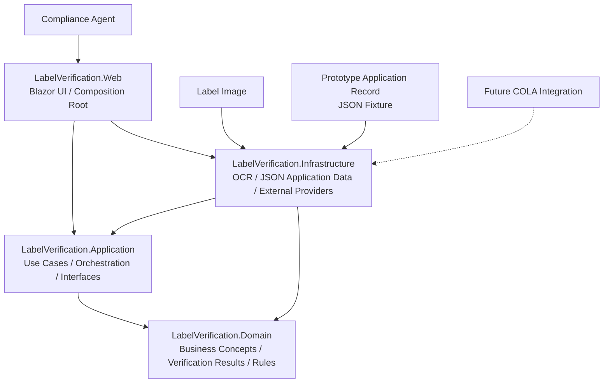
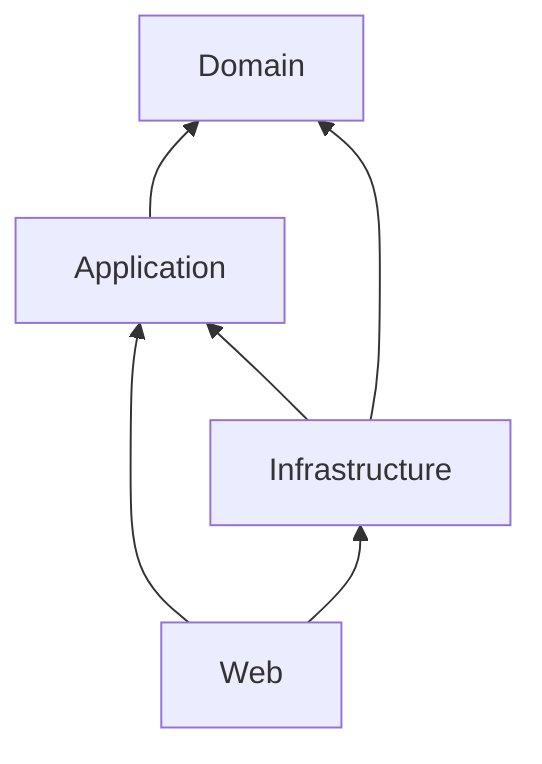
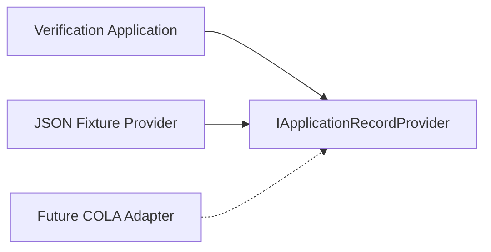
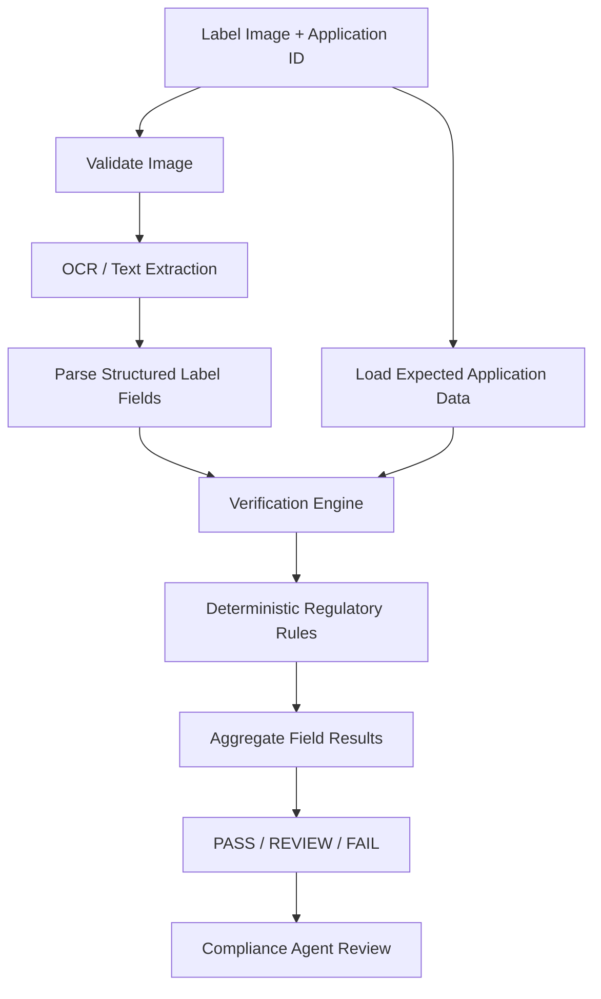
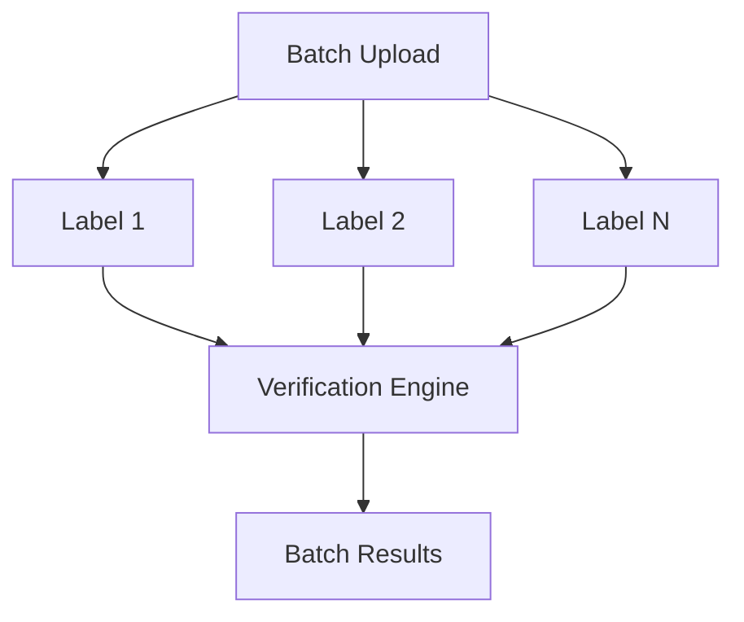

# Application Architecture

## 1. Purpose

This document defines the application architecture for the **AI-Powered Alcohol Label Verification** prototype.

The prototype assists TTB compliance agents by extracting information from alcohol label images, comparing detected values with expected application data, applying deterministic compliance checks where possible, and presenting explainable **PASS**, **REVIEW**, or **FAIL** results for human review.

The architecture is intentionally designed around the following principle:

> **AI for perception and ambiguity; deterministic rules for objective compliance; human judgment for final compliance decisions.**

The prototype is standalone and does not integrate directly with the existing COLA system.

---

## 2. Architectural Goals

The architecture is designed to support:

- Fast verification, with a target user experience of approximately five seconds.
- Clear separation between business rules, workflow orchestration, external technology, and user-interface concerns.
- Explainable verification results rather than opaque AI decisions.
- Human review when OCR confidence or comparison evidence is insufficient.
- Replacement of prototype integrations without rewriting core verification logic.
- Future integration with Treasury and TTB systems through explicit adapter boundaries.
- Testability of regulatory and verification logic independently of OCR providers and the user interface.
- Deployment to Azure without coupling the business domain to Azure-specific services.
- Operation in network-constrained environments with minimal reliance on outbound services.

---

## 3. High-Level Architecture



The Web application acts as the **composition root**. It assembles Application and Infrastructure services using the built-in .NET dependency-injection container.

The important compile-time dependency rule is that Infrastructure may implement interfaces defined by Application, but Application does not reference Infrastructure.

---

## 4. Layer Responsibilities

### 4.1 LabelVerification.Domain

The **Domain** project contains the core business concepts required to express verification results and compliance-related decisions.

Typical responsibilities include:

- Verification status such as `PASS`, `REVIEW`, and `FAIL`.
- Expected and detected label values.
- Field-level verification results.
- Value objects such as alcohol content and net contents.
- Business concepts that do not depend on UI frameworks, OCR vendors, storage providers, or Azure services.
- Pure domain rules where appropriate.

The Domain project should not reference Application, Infrastructure, or Web.

Conceptually, this layer answers:

> **What does the business problem mean?**

Examples of future Domain types may include:

```text
VerificationStatus
FieldVerificationResult
ExpectedLabelData
ExtractedLabelData
AlcoholContent
NetContents
```

---

### 4.2 LabelVerification.Application

The **Application** project coordinates the label-verification use cases.

Typical responsibilities include:

- Verification workflow orchestration.
- Interfaces for application-data providers.
- Interfaces for OCR and text-extraction providers.
- Interfaces for structured field parsing.
- Brand comparison and normalization workflows.
- Alcohol-content verification.
- Net-content verification.
- Government-warning verification.
- Aggregation of field results into an overall verification status.

The Application layer defines **what capabilities are required** while remaining independent of specific external implementations.

For example, the Application layer may define:

```csharp
public interface ILabelTextExtractor
{
    Task<OcrResult> ExtractAsync(
        Stream image,
        CancellationToken cancellationToken);
}
```

The Application layer does not determine whether the implementation uses a local OCR engine, Azure service, or another provider.

That implementation belongs to Infrastructure.

Conceptually, this layer answers:

> **What does the system do?**

---

### 4.3 LabelVerification.Infrastructure

The **Infrastructure** project contains implementations that interact with external technology or external data sources.

Typical responsibilities include:

- OCR provider implementation.
- Reading prototype application records from JSON.
- Image-processing integrations.
- Configuration binding for provider-specific settings.
- Future COLA adapters.
- Future Azure service integrations.
- External storage implementations.
- Telemetry and observability adapters.
- Persistence implementations if required.

Infrastructure implements interfaces defined by the Application layer.

For example:

```text
Application:
    ILabelTextExtractor

Infrastructure:
    LocalOcrLabelTextExtractor
```

Similarly:

```text
Application:
    IApplicationRecordProvider

Infrastructure:
    JsonApplicationRecordProvider
```

A future implementation could introduce:

```text
ColaApplicationRecordProvider
```

without requiring the verification workflow to be rewritten.

Conceptually, this layer answers:

> **How does the system communicate with external technology?**

---

### 4.4 LabelVerification.Web

The **Web** project provides the compliance-agent experience and serves as the application composition root.

Typical responsibilities include:

- Blazor pages and components.
- Label-image upload.
- Application-record selection.
- Initiating verification.
- Displaying field-level expected and detected values.
- Displaying `PASS`, `REVIEW`, and `FAIL` outcomes.
- Displaying explanations and confidence information.
- Presenting ambiguous results for human review.
- Registering Application and Infrastructure services.
- Configuring the ASP.NET Core HTTP request pipeline.

Business and regulatory verification logic should not be implemented directly inside Razor components.

For example, a Razor component should call an application service:

```csharp
var result = await verificationService.VerifyAsync(request);
```

rather than containing detailed comparison or regulatory logic itself.

Conceptually, this layer answers:

> **How does the user interact with the system?**

---

## 5. Dependency Direction

The intended compile-time dependency direction is:

```text
Domain
  ↑
Application
  ↑
Infrastructure

Application
  ↑
Web

Infrastructure
  ↑
Web
```

Another representation is:



The key constraints are:

- `Domain` remains independent.
- `Application` may depend on `Domain`.
- `Infrastructure` may depend on `Application` and `Domain`.
- `Web` may depend on `Application` and `Infrastructure`.
- `Application` must not depend on `Infrastructure`.
- `Domain` must not depend on Web, Infrastructure, or Application.

This prevents user-interface and provider-specific concerns from leaking into core verification logic.

---

## 6. Dependency Injection and Composition Root

The application uses the built-in .NET dependency-injection container provided by:

```text
Microsoft.Extensions.DependencyInjection
```

The project does not introduce a separate dependency-injection framework.

Layer-specific registration methods organize service registration while keeping `Program.cs` focused on application startup.

For example:

```csharp
builder.Services
    .AddApplication()
    .AddInfrastructure(builder.Configuration);
```

`AddApplication()` is responsible for registering Application-layer services.

`AddInfrastructure()` is responsible for registering concrete external implementations such as OCR and application-record providers.

The Web project acts as the **composition root**, where the complete application is assembled.

This enables Infrastructure implementations to be replaced without requiring Application-layer workflow changes.

---

## 7. System Boundary

The prototype begins when application data and a label image are supplied to the verification application.

### The prototype is responsible for:

- Accepting an alcohol label image.
- Validating the uploaded image.
- Loading expected application data.
- Extracting visible text and supporting evidence from the label.
- Parsing relevant label fields.
- Comparing detected values with expected application values.
- Applying supported deterministic regulatory checks.
- Producing explainable field-level results.
- Producing an overall `PASS`, `REVIEW`, or `FAIL` recommendation.
- Presenting results to a human compliance agent.
- Providing sufficient evidence for the agent to understand why a result was produced.

### The prototype is not responsible for:

- Direct COLA integration.
- Modifying COLA records.
- Replacing COLA as a system of record.
- Making final regulatory determinations without human review.
- Long-term records retention.
- Production PII handling.
- Production authentication or authorization.
- Replacing existing TTB systems.
- Implementing all controls required for a production FedRAMP deployment.

These boundaries intentionally keep the prototype focused on demonstrating the verification capability.

---

## 8. COLA Application-Data Boundary

COLA is treated as an **upstream system of record**.

Direct integration is intentionally excluded from the prototype. Instead, the application defines a narrow application-data contract containing only the information required by the verification workflow.

Example:

```json
{
  "applicationId": "COLA-84729",
  "beverageType": "distilled_spirits",
  "expectedData": {
    "brandName": "Old Tom Distillery",
    "classType": "Kentucky Straight Bourbon Whiskey",
    "alcoholByVolume": 45.0,
    "proof": 90,
    "netContents": {
      "value": 750,
      "unit": "mL"
    }
  }
}
```

The prototype implementation reads this contract from local JSON fixtures.

A future COLA integration can implement the same Application-layer interface without changing the verification engine.



This boundary isolates the prototype from COLA implementation details while preserving a clear production integration path.

The Government Warning is not modeled as unique application data. It is evaluated as a supported regulatory rule based on evidence extracted from the label.

---

## 9. Verification Pipeline



The normal verification path should favor deterministic processing after OCR.

AI-assisted or probabilistic processing should be used primarily for:

- Perception.
- Text extraction.
- Image interpretation.
- Ambiguous evidence.
- Classification tasks that cannot be handled reliably with deterministic rules.

AI should not act as the final regulatory authority.

---

## 10. Verification Semantics

Different fields require different comparison strategies.

| Field | Verification Strategy |
|---|---|
| Brand name | Normalization plus controlled fuzzy comparison |
| Class/type | Normalized comparison with ambiguity routed to `REVIEW` |
| Alcohol by volume | Deterministic numeric comparison |
| Proof | Deterministic numeric comparison |
| Net contents | Deterministic value and normalized-unit comparison |
| Government warning | Deterministic regulatory validation when OCR evidence is sufficient |

For example:

```text
STONE'S THROW
Stone's Throw
```

may represent an obvious human-equivalent brand value even though the literal strings differ.

That type of variation may be handled through normalization or controlled fuzzy comparison.

In contrast:

```text
Expected ABV: 45%
Detected ABV: 40%
```

is an objective numeric mismatch and should not require a generative AI model to determine the result.

A low-confidence OCR result should not automatically become a compliance failure.

When evidence is insufficient to make a defensible automated determination, the appropriate system response is:

```text
REVIEW
```

rather than manufacturing certainty.

---

## 11. Government Warning Verification

The Government Warning requires special handling because the wording and presentation carry regulatory significance.

The verification workflow should:

1. Detect whether a Government Warning is present.
2. Extract the warning text.
3. Evaluate OCR confidence and evidence quality.
4. Compare supported wording deterministically.
5. Evaluate capitalization or presentation requirements where the extracted evidence supports that determination.
6. Route insufficient or ambiguous evidence to `REVIEW`.

The system should not convert poor OCR quality directly into a regulatory failure.

For example:

```text
OCR evidence insufficient to validate exact warning wording
```

should produce:

```text
REVIEW
```

rather than:

```text
FAIL
```

unless the available evidence clearly supports a failure.

---

## 12. Human-in-the-Loop Decision Model

The application produces three overall result categories.

### PASS

The extracted evidence is sufficiently reliable and supported deterministic checks pass.

Example:

```text
Brand: PASS
ABV: PASS
Proof: PASS
Net Contents: PASS
Government Warning: PASS

Overall: PASS
```

### REVIEW

The system cannot make a defensible automated determination because of:

- OCR confidence.
- Image quality.
- Ambiguous text.
- Unsupported nuance.
- Conflicting evidence.
- A comparison result within a defined review threshold.

Example:

```text
Government Warning: REVIEW

Reason:
OCR confidence is insufficient to validate exact wording.
```

### FAIL

The available evidence supports a clear mismatch or supported deterministic regulatory failure.

Example:

```text
Expected ABV: 45%
Detected ABV: 40%

Result: FAIL
```

The compliance agent remains the final decision authority.

---

## 13. Explainability

The system should not return only an overall status.

Each verification result should provide evidence that helps the compliance agent understand what occurred.

A field-level result may contain:

```text
Field: Brand Name
Expected: Old Tom Distillery
Detected: OLD TOM DISTILLERY
Status: PASS
Explanation: Values match after case normalization.
```

Another result may contain:

```text
Field: Government Warning
Status: REVIEW
Confidence: 0.61
Explanation: OCR confidence is insufficient to validate exact warning wording.
```

Explainability is particularly important because the prototype supports regulatory review rather than autonomous decision-making.

---

## 14. Performance Architecture

A key stakeholder requirement is an approximately **five-second verification experience**.

A prior scanning pilot reportedly experienced latency in the 30-40 second range, which was considered unacceptable for agent adoption.

The architecture therefore favors:

- Local or low-latency OCR for the normal processing path.
- Deterministic verification after extraction.
- Minimal network dependencies.
- Avoiding unnecessary generative-AI calls in the normal path.
- Explicit timeouts for external providers.
- Measurement of individual pipeline stages.

The application should capture durations for:

```text
Image validation
OCR extraction
Field parsing
Verification
Total request duration
```

Representative benchmark results will be documented after implementation and performance testing.

No performance measurement should be claimed until it has actually been measured.

---

## 15. Batch Processing

The architecture should allow future batch processing without requiring the core verification engine to be redesigned.

A single-label verification operation should remain the fundamental processing unit:

```text
Verify one application + one label
```

Batch processing can then orchestrate multiple independent verification operations.

Conceptually:



Batch capability is valuable because some importers may submit hundreds of labels, but it should not prevent delivery of the core single-label MVP.

---

## 16. Security and Network Considerations

The prototype is designed so routine verification can operate without browser-side API secrets.

No secrets should be embedded in:

- Client-side code.
- Source control.
- JavaScript.
- Configuration files committed to Git.

Production evolution would require additional controls including:

- Authentication.
- Authorization.
- Managed identities where appropriate.
- Role-based access control.
- Secure secret management.
- Private networking where required.
- Audit logging.
- Data-retention controls.
- PII handling requirements.
- FedRAMP-aligned deployment controls.

The prototype does not claim to implement every production security requirement.

The architecture also considers network restrictions that may block outbound domains. Routine processing should therefore minimize unnecessary external network dependencies.

---

## 17. Deployment Boundary

The prototype is intended to run as a standalone .NET web application.

The preferred initial deployment target is:

```text
Azure App Service
```

unless infrastructure requirements introduced by the selected OCR implementation require a containerized hosting model.

A containerized deployment remains an option if native OCR dependencies require greater control over the runtime environment.

The architecture avoids coupling Domain or Application logic to the hosting platform.

This allows the same verification engine to operate regardless of whether the application is eventually hosted using:

```text
Azure App Service
Azure Container Apps
Azure Kubernetes Service
Other supported .NET hosting environments
```

without requiring core business-rule changes.

---

## 18. Testing Boundaries

The layered architecture supports multiple testing levels.

### Unit Tests

Domain and Application verification rules can be tested without:

- Launching the Web application.
- Invoking a real OCR service.
- Accessing COLA.
- Deploying to Azure.

Examples include:

```text
Brand normalization
ABV comparison
Proof comparison
Net-content comparison
Government-warning validation
PASS / REVIEW / FAIL aggregation
```

### Integration Tests

Infrastructure implementations can be tested against:

- Representative JSON fixtures.
- Representative label images.
- OCR implementations.
- Parsing workflows.
- Configuration behavior.

### End-to-End Tests

End-to-end tests can exercise:

```text
Application Record
       +
Label Image
       ↓
Image Validation
       ↓
OCR
       ↓
Field Parsing
       ↓
Verification
       ↓
PASS / REVIEW / FAIL
```

This separation improves reliability while keeping failures easier to diagnose.

---

## 19. Observability

The application should provide enough telemetry to understand both system behavior and performance.

Useful telemetry includes:

- Correlation ID.
- OCR processing duration.
- Parsing duration.
- Verification duration.
- Total request duration.
- Overall result category.
- Error category.
- Provider timeout information.

Sensitive label content or future PII should not be unnecessarily written to logs.

Observability should support troubleshooting without creating unnecessary data-exposure risk.

---

## 20. Error-Handling Principles

Errors should be presented in a way that helps the compliance agent recover without exposing unnecessary technical details.

Examples include:

### Invalid Upload

```text
The selected file is not a supported label image.
```

### OCR Failure

```text
The label could not be read reliably. Please review the image or try another scan.
```

### Application Record Not Found

```text
The selected application record could not be loaded.
```

### Ambiguous Verification

```text
The system could not make a reliable automated determination.
Manual review is required.
```

Technical exception details should be logged for diagnostics rather than displayed directly to end users.

---

## 21. Architectural Trade-Offs

### Local or Low-Latency OCR vs. Remote AI Services

The stakeholder latency requirement strongly favors minimizing network calls on the normal verification path.

A remote AI model may provide additional capabilities, but routine deterministic checks should not depend on unnecessary model round trips.

### Deterministic Rules vs. Generative AI

Deterministic rules are preferred when the compliance question has an objective answer.

Generative AI is more appropriate where the problem involves perception, classification, or ambiguity.

### Standalone Prototype vs. Direct COLA Integration

The prototype intentionally avoids direct COLA integration.

This reduces delivery risk while preserving a clean adapter boundary for future production integration.

### Human Review vs. Autonomous Decisions

The prototype supports agent decision-making rather than replacing it.

When evidence is ambiguous, the system prefers `REVIEW` over unsupported certainty.

---

## 22. Architectural Principles

The architecture follows these principles:

1. Keep regulatory verification logic independent of the user interface.
2. Hide external providers behind Application-layer interfaces.
3. Favor deterministic rules for objective compliance checks.
4. Use AI where perception or ambiguity requires it.
5. Route insufficient evidence to human review rather than manufacturing certainty.
6. Keep the prototype loosely coupled to COLA.
7. Add only the dependencies required by each layer.
8. Maintain explainability at field and overall-result levels.
9. Design the normal processing path around the stakeholder latency target.
10. Preserve clear seams for future production integrations.
11. Keep infrastructure-specific technology out of the Domain layer.
12. Treat the compliance agent as the final decision authority.
13. Measure performance before claiming performance results.
14. Avoid unnecessary network dependencies on the normal verification path.
15. Keep security and production evolution concerns explicit without overclaiming prototype capabilities.

---

## 23. Planned Architecture Decision Records

Significant architectural decisions are recorded separately under:

```text
docs/decisions/
```

Initial Architecture Decision Records include:

```text
0001-layered-architecture.md
0002-hybrid-verification-strategy.md
0003-cola-adapter-boundary.md
```

These ADRs document my reasoning, alternatives, consequences, and trade-offs behind the major architectural decisions in this prototype.