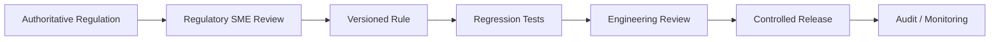

# Regulatory References

## 1. Purpose

This document records the primary regulatory authorities and Alcohol and Tobacco Tax and Trade Bureau (TTB) guidance that informed the bounded compliance checks implemented by the **AI-Powered Alcohol Label Verification** prototype.

Its purpose is to provide traceability between:

- the label elements evaluated by the prototype;
- the corresponding regulatory requirements;
- the current automated verification behavior; and
- the limitations of that automation.

The prototype does **not** represent a complete implementation of Federal alcohol-labeling law and does not replace:

- official TTB regulations or guidance;
- TTB regulatory review;
- legal interpretation;
- Certificate of Label Approval (COLA) review; or
- human compliance judgment.

---

## 2. Prototype Regulatory Scope

The current demonstration is centered on distilled spirits.

The prototype currently represents the following label elements:

| Label Element | Prototype Treatment | Included in Aggregate |
|---|---|---:|
| Brand name | Normalization + controlled fuzzy comparison | Yes |
| Class / type | Extracted and parsed | **No** |
| Alcohol by volume | Deterministic numeric comparison | Yes |
| Proof | Deterministic comparison where present in application data | Yes |
| Net contents | Value and unit normalization + deterministic comparison | Yes |
| Government Health Warning | Bounded deterministic wording and presentation checks | Yes |

The current implementation intentionally covers only a subset of the labeling requirements applicable to a distilled-spirits product.

---

# 3. Regulatory Framework

## 3.1 Federal Alcohol Administration Act

The broader Federal statutory framework for distilled-spirits labeling includes:

```text
27 U.S.C. § 205(e)
```

Among other things, this authority supports regulations intended to:

- prevent deception of consumers;
- provide information regarding product identity and quality;
- provide information regarding alcoholic content;
- provide information regarding net contents; and
- regulate required labeling and packaging information.

The prototype focuses only on a limited portion of the resulting labeling requirements.

---

## 3.2 Distilled Spirits Regulations

The primary Federal distilled-spirits labeling regulations are contained in:

```text
27 CFR Part 5
```

TTB guidance identifies mandatory information for distilled spirits including:

- brand name;
- class, type, or other designation;
- alcohol content;
- net contents;
- health warning statement;
- name and address; and
- additional information when applicable.

The prototype currently automates only the bounded subset described in this document.

---

# 4. Brand Name

## Regulatory References

```text
27 CFR § 5.63
27 CFR § 5.64
```

TTB identifies the brand name as mandatory information on a distilled-spirits label.

The brand name must appear in the same field of vision as:

- alcohol content; and
- class, type, or other required designation.

TTB guidance also explains that a brand name must not create a misleading impression regarding characteristics such as:

- age;
- origin;
- identity; or
- other characteristics of the distilled spirit.

---

## Prototype Implementation

The prototype compares the detected brand-name evidence with the brand name supplied by the application record.

The comparison strategy uses:

```text
case normalization
punctuation normalization
whitespace normalization
controlled fuzzy comparison
```

For example:

```text
Expected:
Stone's Throw

Detected:
STONE'S THROW
```

may be treated as equivalent after normalization.

A less certain similarity may be routed to:

```text
REVIEW
```

rather than automatically classified as either a match or a failure.

---

## Engineering Boundary

The normalization and fuzzy-comparison strategy is an implementation technique.

It does **not** modify or redefine the underlying regulatory requirement.

Human review remains appropriate where a brand-name difference may be legally significant.

---

# 5. Class / Type Designation

## Regulatory References

Relevant authorities include:

```text
27 CFR § 5.63
27 CFR Part 5, Subpart I
```

TTB identifies class, type, or another applicable designation as mandatory distilled-spirits label information.

It must appear in the same field of vision as:

```text
brand name
alcohol content
```

The specific designation depends on the identity and characteristics of the distilled-spirit product.

---

## Prototype Implementation

The prototype currently:

```text
represents expected class/type in the application record
extracts class/type evidence from OCR
parses class/type evidence into structured data
```

### Important Current Limitation

Class/type is **not currently included in the automated aggregate verification result**.

Therefore, the system must not be interpreted as currently verifying class/type compliance as part of the overall `PASS`, `REVIEW`, or `FAIL` decision.

This is a known and documented prototype limitation.

---

# 6. Alcohol Content

## Regulatory Reference

```text
27 CFR § 5.65
```

TTB requires an alcohol-content statement on distilled-spirits products.

Alcohol content is expressed as a percentage of alcohol by volume.

TTB guidance also permits degrees of proof to appear as additional alcohol-content information when the applicable requirements are satisfied.

The required percentage alcohol-by-volume statement remains the primary required alcohol-content representation.

---

## Prototype Implementation

The prototype extracts and compares:

```text
Alcohol by Volume (ABV)
Proof
```

ABV comparison is deterministic.

For example:

```text
Application:
45% alcohol by volume

Detected:
45% alcohol by volume

Result:
PASS
```

A clear numeric mismatch such as:

```text
Application:
45%

Detected:
40%
```

is treated as an objective mismatch rather than sent to a generative AI model for interpretation.

---

## Proof

The prototype also compares proof when proof is represented in the application data.

Proof comparison is application-data matching logic.

It should not be interpreted as treating proof as a substitute for the required alcohol-by-volume statement.

---

# 7. Net Contents

## Regulatory Reference

```text
27 CFR § 5.70
```

The net-contents statement identifies the volume of distilled spirits in the container.

TTB guidance identifies metric expressions such as:

```text
liters
milliliters
L
mL
```

as supported forms of the required statement.

TTB guidance also addresses matters including:

- placement;
- type size;
- legibility;
- standards of fill;
- permitted U.S. equivalent measurements; and
- certain filling tolerances.

---

## Prototype Implementation

The prototype performs deterministic comparison after supported unit normalization.

For example:

```text
Application:
750 mL

Detected:
750 ML

Normalized:
750 mL

Result:
PASS
```

The current implementation does not attempt to automate every requirement involving:

- physical type size;
- exact placement;
- container standards;
- standards of fill;
- measurement tolerance; or
- physical label dimensions.

---

# 8. Government Health Warning

## Regulatory Framework

Primary Federal references include:

```text
27 CFR Part 16
27 CFR § 16.21
27 CFR § 16.22
```

The Government Health Warning applies to covered alcoholic beverages containing the applicable minimum alcohol content and offered for sale or distribution in the United States.

The warning requirement is regulatory rather than application-specific.

For that reason, the prototype does **not** store the expected Government Warning as a field in the mock COLA application record.

Instead, it is evaluated through the supported regulatory-rule set.

---

## Required Warning Text

The required statement begins with:

```text
GOVERNMENT WARNING:
```

and contains the prescribed pregnancy and impairment/health statements required by Federal regulation.

The prototype evaluates the warning against its configured regulatory rule rather than against application-derived expected data.

The authoritative regulation remains the source of truth for the complete required warning text.

---

# 9. Government Warning Presentation

TTB guidance identifies presentation requirements including:

- the warning must be separate and apart from other information;
- the first two words, `GOVERNMENT WARNING`, must appear in capital letters;
- `GOVERNMENT WARNING` must appear in bold type;
- the remainder of the warning may not appear in bold type;
- the statement must appear as a continuous paragraph;
- the warning must satisfy applicable legibility requirements; and
- required type size varies according to container size.

---

## Prototype Implementation

The prototype performs bounded checks for:

```text
warning presence
warning wording
required heading capitalization
bold-heading evidence where supported
```

Font-style evaluation is dependent on the evidence returned by Azure Document Intelligence.

When the OCR provider cannot supply sufficient evidence to make a defensible formatting determination, the system prefers:

```text
REVIEW
```

rather than manufacturing a `PASS` or `FAIL`.

---

## Typography Boundary

The prototype does **not** claim to perform complete physical verification of:

- millimeter type size;
- exact physical spacing;
- label dimensions;
- exact printed contrast;
- all placement requirements; or
- all physical presentation requirements.

Those checks would require additional visual measurement and regulatory validation capabilities.

---

# 10. Field-of-Vision Requirements

TTB guidance states that the following distilled-spirits information must appear in the same field of vision:

```text
Brand name
Class, type, or other designation
Alcohol content
```

"Same field of vision" means the information can be viewed simultaneously on the applicable side of the container without requiring the container to be turned.

---

## Current Prototype Boundary

The current prototype evaluates the textual values associated with these fields but does not perform complete geometric validation of their relative placement on the physical container.

A future visual-layout capability could potentially evaluate:

```text
bounding-box relationships
same-field-of-vision evidence
relative positioning
physical layout requirements
```

That capability is outside the current MVP.

---

# 11. Regulatory Traceability Matrix

| Prototype Concern | Primary Reference | Current Prototype Behavior |
|---|---|---|
| Brand name | 27 CFR §§ 5.63, 5.64 | Automated comparison |
| Class/type | 27 CFR § 5.63; Part 5 Subpart I | Extracted and parsed only |
| Alcohol by volume | 27 CFR § 5.65 | Automated deterministic comparison |
| Proof | 27 CFR § 5.65 and application-data context | Compared where present |
| Net contents | 27 CFR § 5.70 | Automated normalized comparison |
| Government Warning presence | 27 CFR Part 16 | Automated, bounded |
| Government Warning wording | 27 CFR § 16.21 | Automated, bounded |
| Government Warning presentation | 27 CFR § 16.22 | Partially automated based on OCR evidence |
| Same field of vision | 27 CFR Part 5 / TTB guidance | Not currently geometrically verified |

---

# 12. TTB Guidance Consulted

The prototype architecture and regulatory traceability were informed by official TTB guidance concerning:

```text
Distilled Spirits Labeling

Distilled Spirits Labeling:
Mandatory Label Information

Distilled Spirits Labeling:
Brand Name

Distilled Spirits Labeling:
Alcohol Content

Distilled Spirits Labeling:
Net Contents

Distilled Spirits Labeling:
Health Warning Statement

Distilled Spirits Labeling:
Checklist of Mandatory Label Information

Anatomy of a Distilled Spirits Label
```

TTB's current distilled-spirits checklist is particularly useful for validating mandatory-information coverage during future development.

---

# 13. Authoritative Source Hierarchy

When implementing or changing regulatory rules, the project should use the following source priority:

```text
1. Current Federal statute
2. Current eCFR regulatory text
3. Current official TTB guidance
4. Approved regulatory subject-matter-expert interpretation
5. Internal implementation documentation
```

Application code, tests, README text, ADRs, or sample data must not become the authoritative source for the underlying regulatory requirement.

---

# 14. Regulatory Engineering Principles

A production regulatory-rule system should make requirements:

### Traceable

Each automated rule should identify its authoritative basis.

### Version Controlled

Rule changes should be committed and reviewed like application code.

### Testable

Regulatory rules should have deterministic regression tests.

### Effective-Date Aware

A production implementation should account for regulatory changes that become effective on particular dates.

### Auditable

It should be possible to determine:

```text
which rule version ran
which evidence was evaluated
which result was produced
when the verification occurred
```

### Independently Reviewed

Regulatory subject-matter experts should review rule implementations before production release.

---

# 15. AI and Regulatory Authority

OCR confidence is evidence quality, not regulatory truth.

The architecture therefore maintains the following separation:

```text
AI / OCR
    |
    | extracts evidence
    v
Structured Evidence
    |
    | evaluated against rules
    v
Deterministic Verification
    |
    | produces decision support
    v
PASS / REVIEW / FAIL
    |
    v
Human Compliance Agent
```

The AI provider does not establish Federal labeling requirements.

The deterministic rule implementation does not replace regulatory judgment where the requirement or evidence is ambiguous.

The human compliance reviewer remains the final authority.

---

# 16. Known Regulatory Coverage Limitations

The prototype does not attempt to automate every distilled-spirits labeling requirement.

Examples outside the current automated scope include:

- complete standards of identity;
- all class/type requirements;
- statements of composition;
- all distinctive or fanciful-name requirements;
- age statements;
- geographic-origin requirements;
- country-of-origin requirements;
- name and address validation;
- coloring disclosures;
- treatment-with-wood disclosures;
- sulfite declarations;
- ingredient disclosures;
- allergen-related requirements;
- commodity statements;
- neutral-spirits disclosures;
- every typography requirement;
- complete label-placement verification;
- standards of fill;
- every container requirement;
- every special-product requirement;
- every COLA approval condition.

These omissions are intentional prototype boundaries.

---

# 17. Production Rule Governance

A production implementation should establish a formal regulatory-rule lifecycle.

A possible workflow is:



Changes should not be made solely because an AI model, developer, or external secondary source interprets a regulation differently.

---

# 18. Prototype Disclaimer

This application is an engineering prototype demonstrating how AI-assisted perception and deterministic rules can support alcohol-label review.

It is **not**:

- an official TTB regulatory system;
- a replacement for COLA;
- legal advice;
- an autonomous regulatory adjudication system; or
- a complete implementation of Title 27 labeling requirements.

All final regulatory determinations remain subject to authoritative Federal requirements and human review.

---

# 19. Source Currency

These references were reviewed during final evaluator-documentation preparation in **August 2026**.

The regulatory documentation reflects the prototype's understanding of the cited authorities at that time.

TTB guidance can be revised, and Federal regulations can change.

Before modifying or deploying production regulatory rules:

1. verify the current eCFR;
2. verify current TTB guidance;
3. identify any effective-date changes;
4. obtain regulatory subject-matter-expert review;
5. update automated regression tests; and
6. record the resulting rule version.

---

# 20. Summary

The prototype's regulatory strategy is intentionally narrow and traceable:

```text
Authoritative Regulation
        |
        v
Bounded Deterministic Rules
        |
        +
OCR Evidence
        |
        v
Explainable Verification
        |
        v
PASS / REVIEW / FAIL
        |
        v
Human Compliance Judgment
```

The purpose of automation is to make routine comparison faster and more consistent while preserving regulatory traceability and human authority.